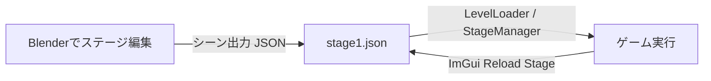

# レベルエディター（Blenderアドオン & レベルローダー）操作マニュアル

このドキュメントでは、Blenderアドオン（`Level_editer`）を使ってステージ・エネミー・レールなどを編集し、ゲーム側（`LevelLoader` / `StageManager`）で読み込んで反映させるまでの全手順を解説します。

---

## 1. 全体構造の概要



- **Blender側 (`Editer/Level_editer/`)**:
  - オブジェクトタイプ設定（地形、ブロック、敵、レール、トリガー等）
  - コライダー設定・モデル名・テクスチャ設定
  - シーン全体のJSONエクスポート
- **ゲーム側 (`application/level/`)**:
  - `LevelLoader`: JSONをDirectX座標系に自動変換してパース
  - `StageManager`: レール、敵、地形、ブロック、トリガーを実体化・統括
  - `GameScene`: 読み込んだ全オブジェクトの当たり判定・更新・描画を一括処理

---

## 2. Blender側でのセットアップ・更新方法

フォルダ管理やZIP圧縮の手間をなくし、**単一ファイル（`level_editor.py`）だけで読み込み・即時更新**できるようにしています。

### 🌟 おすすめ：Blenderのテキストエディタで即時実行（インストール不要・一発更新）
1. Blenderを起動し、上部の **[Scripting]** ワークスペース（またはテキストエディター画面）を開きます。
2. **[開く (Open)]** を押し、本プロジェクト内の **`Editer/level_editor.py`** を選択して開きます。
3. 画面上の **[▶ スクリプト実行 (Run Script)]** ボタン（またはキーボードの `Alt + P`）を押します。
4. **これだけで最新のメニュー（シーンロード・座標変換対応）が即座に反映されます！**
   - ※ 今後コードを変更した場合も、テキストエディタで [▶ スクリプト実行] を押すだけで一瞬で更新されます。

### アドオンとしてファイル単体をインストールする場合
1. Blenderの **[編集 (Edit)] → [プリファレンス (Preferences)] → [アドオン (Add-ons)]** を開きます。
2. 右上の **[インストール (Install...)]** ボタンをクリックします。
3. `Editer/level_editor.py` **ファイル単体を選択**してインストールします。
4. 一覧で「**レベルエディタ**」にチェックを入れます。

---

## 3. 各オブジェクトの配置・設定方法

### ① ステージ進行レール (`STAGE_RAIL`) / カメラレール (`CAMERA_RAIL`)
1. **生成方法（2通り）**:
   - **方法A（プリセットから1クリック生成）**:
     - 右側プロパティ **[Rail Settings & Mode]** パネルの **[レールプリセット生成]** から `[円形周回]`、`[S字カーブ]`、`[直線]` を選択して一瞬で作成できます。
   - **方法B（手動追加）**:
     - `Shift + A` → **[カーブ (Curve)] → [ベジェ (Bezier)]** を追加し、名前を `StageRail` または `CameraRail` にします。
     - オブジェクトプロパティで `object_type` を `STAGE_RAIL` または `CAMERA_RAIL` に設定します。
2. **直感的なレールの引き方（カーブペンツール）**:
   - 上部メニュー **[MyMenu] → [カーブペン描画ツール起動]**、またはパネルの **[カーブペン描画ツール起動]** を押します。
   - 画面上をマウスクリックするだけで、次々に制御点を追加・延長して思い通りのコースラインを引くことができます。
3. **エンジンの三種曲線補間切替（Linear / Bezier / Catmull-Rom）**:
   - 右側プロパティ **[Rail Settings & Mode]** パネルの **[🎯 エンジン三種曲線補間切替]** で、エンジンの3種の補間方式を制御点ごと、またはレール全体で自由に切り替えられます：
     - 🟡 **直線 (Linear)**:
       - 2点間を直線でリニア（Lerp）補間します。
       - ハンドルが自動的に `VECTOR`（直線）になり、Blender上でもゲーム内でも正確な直線コースになります。
       - 3Dビュー上では**黄色**の球体ワイヤーで描画されます。
     - 🟢 **三次ベジェ (Bezier)**:
       - 制御点のハンドル角度や長さによる自由な3次ベジェ曲線補間です。
       - ハンドル操作で曲がり具合を細かく調整可能。
       - 3Dビュー上では**緑色**の球体ワイヤーで描画されます。
     - 🔴 **キャットムル・ロム (Catmull-Rom)**:
       - すべての制御点を必ず通り、自然で滑らかな曲線を自動計算する補間です。
       - クリックすると、Catmull-Romの接線方程式 $T_i = \frac{1}{6}(P_{next} - P_{prev})$ に基づいてBlenderのベジェハンドルが自動計算され、**ゲームエンジンと100%幾何学的に一致する曲線**がBlender上に描画されます！
       - 3Dビュー上では**赤色**の球体ワイヤーで描画されます。
   - **【選択した制御点に適用】**: 編集モードで選択中の制御点のみ指定した補間に切り替えます。
   - **【レール全体に一括適用】**: レール全体のすべての制御点を一発で切り替えます。
4. **ゲームエンジン連動**:
   - シーン出力（エクスポート）時に、各制御点の補間タイプ（`LINEAR` / `BEZIER` / `CATMULL_ROM`）がJSONにそのまま書き出されます。
   - ゲーム読み込み時、指定された補間方式で `RailPath` に登録され、プレイヤー・敵・弾・カメラが正確にその補間軌道に沿って移動します！
   - ゲーム実行中も ImGui の **「Rail Debug」** から補間挙動をその場で切り替えて比較テストが可能です。

---

### ② 接地・壁判定ブロック (`BLOCK` / `StageBlock`)
プレイヤーが乗ったり壁として衝突したりできる直方体・直方体ブロックです。
1. `Shift + A` → **[メッシュ (Mesh)] → [立方体 (Cube)]** を配置します。
2. オブジェクトプロパティの **[Object Type Settings]** パネルでタイプを `BLOCK` に設定します。
3. プロパティまたは **[FileName]** パネルでモデル名を設定します：
   - 組み込みの直方体を使う場合: `file_name` = `"box"`
   - テクスチャを指定する場合: `texture` = `"resources/grass.png"`
4. 配置・スケール・回転を好みに合わせて調整します。
   - ゲーム側で自動的にワールド三角形ポリゴンが抽出され、プレイヤーの足場・壁判定になります。

---

### ③ 傾斜スロープ (`SlopeBlock`) ＆ 階段・段差 (`StairsBlock`)
坂道や段差をワンクリックでステージに配置できます。
1. **生成方法**:
   - 上部メニュー **[MyMenu]** → **[傾斜スロープ追加]** または **[階段ブロック追加]** をクリック。
   - または、オブジェクトプロパティの **[FileName]** パネルにある **[地形・段差ブロック追加]** からも追加可能です。
2. **傾斜スロープ (`SlopeBlock`)**:
   - 登り降り可能なウェッジ形状（三角柱）の傾斜ブロックです。
   - プレイヤーは坂道を登るときも、下るときも**地面吸着（Ground Snapping）**により跳ねたりカクついたりせずスムーズに歩行できます。
   - スケール（`S`キー）や回転（`R`キー）で傾斜角や長さ・幅を自由に調整可能。
3. **階段・段差ブロック (`StairsBlock`)**:
   - 4段ステップの階段モデルです（1段の蹴上げ高さ = 0.25m）。
   - ゲーム側の**段差ステップアップ（Step Height）機能**（最大 0.35m まで登攀可能）により、ジャンプせずとも歩くだけで足元が引っかからずに階段をスムーズに駆け上がれます！
   - 段差を連続して並べることで、高層エリアや立体的なプラットフォームステージを自在に構築できます。

---

### ④ 地形モデル (`TERRAIN`)
広大なステージ地面モデルなどを配置する場合に使用します。
1. メッシュオブジェクトを配置します。
2. タイプを `TERRAIN` に設定します。
3. カスタムプロパティを設定します：
   - `file_name`: `"TentativeStage.obj"` （モデルファイル名）
   - `model_dir`: `"resources/Stagemap"` （モデルフォルダ）
   - `texture`: `"resources/Stagemap/863603.png"` （テクスチャ画像）

---

### ④ エネミー配置 (`ENEMY`)
エディター上では、単なる十字軸ではなく**ゲームと同じ敵モデル（`taru.obj` / 樽）が3Dメッシュとして自動描画**されます！
1. `Shift + A` → **[エンプティ]** または **[メッシュ]** を配置します。
2. **[Object Type Settings]** パネルで **[ENEMYにする]** をクリックします。
   - 自動的に敵モデル（樽）が割り当てられ、3Dビュー上で見た目や向きが直感的に確認できます。
3. 敵のタイプや配置パラメータをカスタムプロパティで指定します：
   - `enemy_type` (String):
     - `"Normal"` : 通常エネミー（`TestEnemy`）
     - `"Bound"` : バウンドエネミー（`BoundEnemy`）
   - `rail_pos`: `[進行度t, 高さy]`（マグネット吸着で自動設定されます）

---

### ⑤ プレイヤー開始位置 (`PLAYER_SPAWN`) / ゴール (`GOAL`)
エディター上でも**プレイヤーの3Dモデル（`player.obj`）やゴール（`goal.obj`）がメッシュとして表示**されます！
1. オブジェクトを配置し、名前を `PlayerSpawn` または `Goal` に変更します。
2. **[Object Type Settings]** パネルで **[PLAYERにする]** または **[GOALにする]** をクリックします。
   - 自動的にプレイヤーモデルまたはゴールモデルが適用されます。
3. レール進行度を設定します：
   - プレイヤー開始位置: `PLAYER_SPAWN` （`rail_pos`: `[0.0, 0.0]`）
   - ゴール位置: `GOAL` （`rail_pos`: `[3.0, 2.0]` などレールの終端付近）

> [!TIP]
> **モデルのゲーム座標系からBlender座標系への自動変換**
> リソースフォルダ内のモデル（`taru.obj`, `player.obj`, `goal.obj`, `TentativeStage.obj` など）はゲーム（DirectX: Y-up, Z-奥）向けに作成されていますが、エディター側で読み込む際に**自動的にBlender座標系（Z-up, Y-奥）へ軸変換・法線補正**されて生成されます。そのため、モデルが倒れて寝てしまったり前後が逆になることなく、正しい天地・向きで表示されます！
>
> **既に開いているシーンで十字軸（Empty）のまま表示されている場合**
> 上部メニュー **[MyMenu] → [全Enemy/Playerをモデル表示に更新]** を押すだけで、シーン内の全敵・プレイヤー・ゴールが一瞬でBlender座標系に合わせた3Dモデルメッシュ表示に切り替わります！

---

### ⑥ イベントトリガー (`TRIGGER`)
エリア通過・侵入を検知する透明なトリガー領域です。
1. `Shift + A` → **[エンプティ (Cube または Sphere)]** を配置します。
2. タイプを `TRIGGER` に設定します。
3. プロパティを設定します：
   - `event_name`: 発火させるイベント名（例: `"BossBattleStart"`, `"PlayBGM"`, `"TrapOpen"`）
   - `fire_mode`: `"once"` (1回のみ), `"continuous"` (侵入中毎フレーム), `"enter_exit"` (出入り時)
   - `collider_size`: 検知ボックスのサイズ

---

### ⑦ 物理ギミック (`PBD_ROPE` / `PBD_CLOTH`)
ロープや旗・布などのリアルタイム物理演算オブジェクトです。
1. エンプティまたはメッシュを配置し、タイプを `PBD_ROPE` または `PBD_CLOTH` に設定します。
2. プロパティで剛性（`stiffness`）、分割数（`num_points`）、重力（`gravity_y`）などを設定します。

---

### ⑧ 🌟 星のカービィ64風 AIステージ自動生成・伸長機能
手動でレールやブロックを1つずつ並べる手間を省き、AI（プロシージャル生成）によってカービィ64風のコースを一瞬で延長・自動生成できます！

1. **実行方法（2通り）**:
   - **方法A（上部メニューから）**:
     - 上部メニュー **[MyMenu] → [🌟 AIコース自動生成・伸長]** をクリック。
   - **方法B（プロパティパネルから）**:
     - レール（`StageRail`）を選択し、プロパティの **[Rail Design & Curves]** パネル最下部にある **[🚀 コースをAI自動生成・伸長]** をクリック。
2. **調整可能なパラメータ**:
   - **ステージ環境 (Environment)**:
     - 🌿 **緑の平原 (Green Plains)**: コース全体を覆う広大な草原地面（`terrain_grid`）となだらかな草道・丘陵コース。自然な地形ステージを作成する際に選択します。
     - 🧱 **浮遊アスレチック (Platforms)**: 空中に直方体ブロック（`BLOCK`）が並び、穴飛び越えや高台がメインのアスレチックコース。
   - **カメラ視点位置 (Camera Side)**:
     - 🎥 **右側 (Right Side / 2.5D標準)**: プレイヤーの進行方向の**右手側（画面手前側）**から撮影する標準の2.5Dカメラアングル。
     - 🎥 **左側 (Left Side / 反転)**: プレイヤーの進行方向の**左手側**から撮影する反転アングル。
   - **伸長セクション数**: 追加するコースの長さ（区間数。1区間約12〜16m）。
   - **コーススタイル (Theme)**:
     - 🟢 **バランス (Balanced)**: 直線・カーブ・坂・敵がバランスよく配置された標準ステージ。
     - 🟡 **初心者向け (Beginner)**: 直線中心で穴がなく、平坦で安心して走れるコース。
     - 🔴 **ジェットコースター (3D Action)**: 直角90°コーナーやS字カーブ、起伏に富んだダイナミックなコース。
     - 🟣 **アスレチック (Challenge)**: ジャンプ穴や浮遊足場、敵の配置が多いテクニカルコース。
   - **カーブの激しさ / 高低差 (坂道) / ジャンプ穴の頻度 / 敵の出現頻度**: 0.0〜1.0のスライダーで微調整可能。
   - **足場ブロックを自動配置**: レールに沿って自動で足場ブロックや草道を生成・整列。
   - **カメラレールを自動同期**: 伸びたコースに合わせて `CameraRail` も自動で延長同期。
   - **ゴールを新終端へ移動**: 既存の `Goal` を新しく伸ばしたレールの終端へ自動移動。
   - **ランダムシード**: 気に入らない場合はシード値を変えて再生成したり、`Ctrl + Z`（取り消し）で直前の状態に戻せます。

---

## 4. JSONステージデータのエクスポート・インポート手順

### ① シーン出力（エクスポート: Blender座標 → ゲーム座標）
1. Blender 上部メニューの **[MyMenu]** をクリックします。
2. **[シーン出力]** を選択します。
3. 保存ダイアログが開きます。
   - **「ゲーム座標系に変換 (Blender -> Game)」** にチェック（デフォルトON）が入っていることを確認します。
     - Blenderの座標系（X右, Y奥, Z上）からゲーム（DirectX）座標系（X右, Y上, Z奥）へ自動変換されて保存されます。
     - レール（CURVE）やコライダーの配置もすべてゲーム座標系に自動変換されます。
4. 出力先を指定して保存します：
   - **保存先パス**: `(プロジェクトフォルダ)/resources/Stagemap/stage1.json`
5. 画面下に「シーン情報をExportしました」と表示されれば成功です！

### ② シーンロード（インポート: ゲーム座標 → Blender座標 & レール自動配置）
出力済みのステージJSONをBlenderに再読み込みして復元・編集する場合に使用します。
1. Blender 上部メニューの **[MyMenu]** をクリックします。
2. **[シーンロード]** を選択します。
3. ファイル選択ダイアログで読み込みたい JSON ファイル（例: `stage1.json`）を選択します。
   - **「ゲーム座標系から変換 (Game -> Blender)」**: チェック（デフォルトON）を入れると、ゲーム座標系のステージ配置がBlender座標系に逆変換されて正しく配置されます。
   - **「rail_pos をレール上に自動配置」**: チェック（デフォルトON）を入れると、`PlayerSpawn` や `Enemy`, `Goal` など `rail_pos` を持つオブジェクトが、Blender上のベジェレール（CURVE）から進行度 $t$ を自動計算してゲームと全く同じレール上の位置にスナップ配置されます。
   - **「既存オブジェクトを上書き」**: 同名オブジェクトが存在する場合に削除して再生成します。
4. **[シーンロード]** ボタンをクリックすると、シーン内にレール、ブロック、敵などのオブジェクトが配置され、Emptyが自動的にレール上の正しい位置へ整列します。

---

### ③ レール配置パネル (Rail Position Settings) の使い方
敵やプレイヤーなどのEmptyオブジェクトを選択すると、右側のプロパティに **[Rail Position Settings]** パネルが表示されます。

- **🧲 レール自動吸着 & 追従 (近づくと吸着 / レール移動に追従)**:
  - **オブジェクト移動時に吸着 (デフォルト: ON)**:
    - 3Dビュー上でエネミーやプレイヤーをドラッグ移動（`G` キー等）してレールの近くに持っていくと、**吸着距離（デフォルト3.0m）以内に入った瞬間にピタッとレール上の正確な位置に自動吸い寄せられてスナップ**します！
    - 同時に `rail_pos`（進行度 $t$ と高さ $y$）もリアルタイムに自動更新されます。
  - **レール移動時に追従 (デフォルト: ON)**:
    - **レール（StageRail）自体を移動・回転・スケール変更したり、編集モードでカーブの頂点やハンドルを動かしてコース形状を変えた際、レール上のエネミー・プレイヤー・ゴールがその変形に連動してリアルタイムに追従し、レール上にとどまります！**
  - **吸着距離 (m)**: 吸い付く判定距離を自由に調整できます。
  - **現在の高さを維持**: オブジェクトの現在のZ高さをキープしたままレールに吸着させるか（デフォルトON）を設定できます。
  - **[全オブジェクトをレールへ再配置] ボタン**:
    - シーン内のすべてのエネミー、プレイヤー、ゴールを各 `rail_pos` に従ってレール上に一括で再配置します。
- **レール位置へスナップ (Snap to Rail)**:
  - 選択中オブジェクトの `rail_pos: [t, y]` に基づき、いつでもオブジェクトをレール上の正確な位置へ再配置します。
- **現在地から逆算 (Calculate rail_pos)**:
  - 手動でボタンを押して最寄りレール位置を逆算・スナップさせたい場合に使用します。

---

### ④ カメラ・ステージレールの自動連携・分離機能
`StageRail`（プレイヤー進行レール）の形状をベースに、カメラ追従レール（`CameraRail`）を**自動生成・連携（リアルタイム同期）**させたり、**独立して個別に微調整できるよう分離**する機能です。

- **📸 自動連携（生成・同期）**:
  - **[生成・同期] ボタン**:
    - `StageRail` のカーブ制御点から、指定した外側距離（デフォルト: 25m）と高さ（デフォルト: 5m）を計算し、相似・オフセットされた `CameraRail` を瞬時に作成・同期します。
  - **リアルタイム連携モード (トグル)**:
    - ON にすると、`StageRail` を変形・移動した際に、`CameraRail` もリアルタイムに自動変形して追従します。
  - **カメラ距離 (m) / カメラ高さ (m)**:
    - カメラレールの外側への距離や高さをスライダーで自由に調整できます。
  - **オフセット向きを反転 (内側)**:
    - 外周ではなく内周側にカメラレールを配置したい場合に切り替えます。
- **✂ 連携を分離 (独立編集モード)**:
  - **[分離する] ボタン**:
    - 追従連携を解除し、特定のカーブ区間だけカメラアングルを近づけたり高さを変えたりと、`CameraRail` を単独で自由に編集できるようになります。
- **🔮 接続点・球体ワイヤーフレーム表示**:
  - **球体ワイヤー表示 (デフォルト: ON)**:
    - 3Dビューポート上に、`StageRail` の接続点（**シアン色の球体ワイヤー**）と `CameraRail` の接続点（**オレンジ色の球体ワイヤー**）をリアルタイムオーバーレイ描画します。
    - 連携中は、対応する接続点同士を結ぶ黄色の連携ガイド線が表示され、どの点同士が連動しているかが一目瞭然になります。
  - **球体サイズ (m)**: 表示する球体ワイヤーフレームの半径を調整できます。

---

## 5. ゲーム内での確認・ホットリロード（即時反映）

1. ゲーム（Visual Studioからデバッグ実行）を起動します。
2. 起動時に `stage1.json` が自動的に読み込まれ、配置したレール・地形・エネミー・ゴールがそのまま画面に反映されます。

### 🔥 超便利機能：実行中の即座リロード（ホットリロード）
ゲームを起動したまま、Blender側で位置や敵の配置を修正して **[シーン出力]** で上書き保存した場合：
- ゲーム画面の ImGui **「Debug」** ウィンドウ内にある **[Reload Stage (stage1.json)]** ボタンをクリックするだけで、**ゲームを終了・再起動することなく一瞬で最新の配置に更新されます！**

---

## 6. カスタムプロパティ一覧（早見リファレンス）

| プロパティ名 | 型 | 設定例 | 説明 |
| :--- | :--- | :--- | :--- |
| `object_type` | String | `STAGE_RAIL`, `BLOCK`, `ENEMY` 等 | オブジェクトの基本役割 |
| `disabled` | Bool | `true` / `false` | `true` にすると一時的に配置を無効化 |
| `file_name` | String | `"box"`, `"TentativeStage.obj"` | 読み込む3Dモデル名 |
| `texture` | String | `"resources/grass.png"` | 貼り付けるテクスチャ画像パス |
| `enemy_type` | String | `"Normal"`, `"Bound"` | 敵の種類（ファクトリーに対応） |
| `rail_pos` | Array | `[0.5, 0.0]` | レール配置時の座標 `[t, y]` |
| `loop` | Bool | `true` / `false` | レールを周回ループさせるか |
| `event_name` | String | `"StageClear"` | トリガー発火時のイベント識別文字列 |
| `fire_mode` | String | `"once"`, `"continuous"`, `"enter_exit"` | トリガーの発火タイミング |

---

## 7. コース地形の自動生成（terrain_grid 方式）

`StageRail` のコース形状を読み取り、**ゲーム側の動的地形生成機能（`terrain_grid`）** を使って地形を生成するための `TERRAIN` オブジェクトをシーンに自動配置する機能です。

### 仕組みの概要

```
[Blender エディター]
  StageRail のバウンディングボックス計算
      ↓
  TerrainGround (TERRAIN, file_name="terrain_grid") を配置
  properties に size_x/size_y/divisions_x/divisions_y を設定
      ↓
  シーン出力 (JSON) でゲームに渡す

[ゲーム側]
  LevelLoader が terrain_grid を検出
      ↓
  StageBlock::Initialize() → ModelManager::CreateTerrainModel() を呼び出し
      ↓
  頂点データを動的生成・プレイヤーの足場・壁判定として機能
```

### 🌟 使い方

1. Blenderのシーンに `StageRail`（`object_type: STAGE_RAIL`）カーブが存在することを確認します。
2. 上部メニューの **[MyMenu]** をクリックします。
3. **[コース地形を自動生成]** を選択します。
4. ダイアログが開き、コースサイズの推定値が表示されます。パラメータを調整します。
5. **[OK]** を押すと `TerrainGround` オブジェクトがシーンに配置されます。
6. **[シーン出力]** でJSONにエクスポートするとゲームで反映されます。

### パラメータ一覧

| パラメータ | デフォルト値 | 説明 |
| :--- | :--- | :--- |
| **マージン** | 10.0 m | コース範囲の外側に付加する余白 |
| **密度（分割数/m）** | 1.0 | 地形の 1m あたりの分割数（大きいほど滑らか） |
| **最大分割数** | 64 | 1軸あたりの分割数の上限 |
| **地形の高さ（Z）** | -0.5 | 地形の高さ位置（Blender Z 軸 = ゲームの Y 軸） |
| **テクスチャパス** | `resources/Stagemap/863603.png` | 地形テクスチャ（プロジェクト相対パス） |
| **UVタイル倍率** | 4.0 | テクスチャのタイリング回数 |
| **プレビューメッシュを表示** | ON | Blenderビューポートにワイヤーフレームグリッドを表示 |

### Blenderシーン上での見え方

- **`TerrainGround`**（Empty）: ゲームへのデータキャリア。カスタムプロパティに `prop_size_x` 等が設定されています。
- **`TerrainGround_Preview`**（Mesh・ワイヤーフレーム）: Blender上で地形の大きさを確認するためのプレビュー。エクスポートされません。

> [!TIP]
> **エクスポートされるJSONの例:**
> ```json
> {
>     "name": "TerrainGround",
>     "type": "EMPTY",
>     "object_type": "TERRAIN",
>     "file_name": "terrain_grid",
>     "texture": "resources/Stagemap/863603.png",
>     "properties": {
>         "size_x": "160.0",
>         "size_y": "160.0",
>         "divisions_x": "32",
>         "divisions_y": "32",
>         "uv_tile": "4.0"
>     }
> }
> ```

> [!NOTE]
> **ゲーム側 `CreateTerrainModel()` の動作**
> `StageBlock::Initialize()` が `terrain_grid` を検出すると、
> `properties` の値（`size_x`, `size_y`, `divisions_x`, `divisions_y`, `uv_tile`）を読み取って
> `ModelManager::CreateTerrainModel()` を呼び出し、頂点データを動的生成します。
> 生成されたメッシュはプレイヤーの足場・壁判定（`GetWorldTriangles()`）として機能します。

> [!WARNING]
> **既存の `GroundTerrain` について**
> 手動で配置した `GroundTerrain`（`TentativeStage.obj` 参照）と `TerrainGround` を
> 同時にシーンに置くと地形が重複します。どちらか一方を `disabled = true` にするか削除してください。


## 8. OBJモデルから地形グリッドへの変換機能（新機能）

配置済みの OBJ モデル（または任意のメッシュオブジェクト）を選択し、**ワンクリックで動的地形生成（`terrain_grid`）用オブジェクトへ変換**できる機能です。

### 特徴
- **バウンディングボックス自動解析**: メッシュの幅(X)・奥行き(Y)・高さ(Z)をワールド座標系で正確に計測
- **テクスチャ自動継承**: 元モデルのマテリアルやプロパティからテクスチャパスを自動検出
- **元モデルの柔軟な処理**: 「置換（元モデル削除）」「非表示化（バックアップ保持）」「そのまま保持」から選択可能
- **高さ基準の選択**: 原点、メッシュ上面(Top)、下面(Bottom)、カスタム指定値から床面の高さを選択可能

### 🌟 使い方

1. Blenderの3Dビューポートで、地形にしたい **メッシュオブジェクト（OBJModel）** を選択します。
2. 以下のいずれかの方法で変換を実行します：
   - **メニューバー**: `TopBar > MyMenu > OBJモデルを地形グリッドに変換`
   - **オブジェクトプロパティ**: `Object Properties > Object Type Settings` パネル内の **[このメッシュを地形グリッドに変換]** ボタン
3. ポップアップダイアログで、元モデルのサイズ・Z範囲・推定分割数が表示されます。
   - **余白マージン**: 必要に応じて地形を少し広げる場合に設定
   - **密度 / 最大分割数**: グリッドの細かさ
   - **高さ基準（Z）**: 地面の高さを合わせる基準（原点 / 上面 / 下面 / 指定値）
   - **元モデルの処理**: 置換（推奨）・非表示化・保持
4. **[OK]** を押すと変換完了！プレビュー用ワイヤーフレームが自動生成され、シーン出力時に `terrain_grid` としてエクスポートされます。

---

## 9. レール沿いに地面を変形して道をつくる機能（新機能）

別個の道路パーツを置くのではなく、**既存の地面メッシュ（`TerrainGround` 等）そのものをレールの経路・幅・高さ・勾配に合わせて盛り上げ・変形し、地面そのものを道路・土手にする**機能です。

### 特徴
- **台形断面の道路造形**:
  - **道路平坦幅（中央部）**: レール直下の指定した幅（例: 4.0m）が、レールの高さに合わせて完全に平らになり、プレイヤーが歩行・走行しやすい道になります。
  - **法面・斜面幅（外側）**: 道路の端から元の地面へ向かって滑らかな傾斜（スロープ）でなだらかに下りる土手（盛土・堤防）を形成します。
- **地形の自動生成**: シーン内に地面メッシュがまだない場合、レールに合わせて十分な分割数のグリッド地面（`TerrainGround`）を自動作成した上で変形します。
- **ゲーム側コリジョンへの自動反映**:
  - 変形された地面は自動的に `resources/Stagemap/terrain_deformed.obj` としてエクスポートされます。
  - ゲームエンジン側（C++）の `StageBlock` がこのモデルを読み込み、`GetWorldTriangles()` でポリゴン当たり判定（坂道・傾斜スロープ・段差）を自動構築するため、**Blenderで盛り上げた地面の起伏がそのままゲーム内でプレイヤーの足場・坂道になります！**

### 🌟 使い方
1. 3Dビューポートで **レール（StageRail 等の Curve）** を選択します。
2. オブジェクトプロパティの **[Rail Design & Curves]** パネル（または上部メニュー **[MyMenu]**）にある **[レール沿いに地面を変形して道をつくる]** ボタンをクリック。
3. ポップアップダイアログでパラメータを設定します：
   - **道路の平坦幅 (m)**: デフォルト 4.0m（中央の歩ける道幅）
   - **法面・土手の斜面幅 (m)**: デフォルト 4.0m（地面へ下りるスロープ幅）
   - **高さオフセット (m)**: 0.0m（レールの高さに一致）
   - **斜面の形状（減衰）**: スムーズ（丸みのある自然な土手） / リニア（直線的な台形斜面）
4. **[OK]** を押すと、地面メッシュがレールに沿ってグッと盛り上がり、道が完成します！
5. レールを修正・延伸した際も、再度ボタンを押せば瞬時に最新のレール形状に合わせて地面が再変形されます。

---

## 10. なぞって地形変形 ＆ フリーハンドレール作成（新機能）

マウスやペンでなぞって直感的にコースや地形を作れる機能群です。

### ① ペンでなぞってレールを描く（フリーハンド）
- **使い方**:
  1. 上部メニュー **[MyMenu]** または **[Rail Design & Curves]** パネルの **[ペンでなぞってレールを描く]** をクリック。
  2. 3Dビューポート上でマウスやペンタブをドラッグして線をなぞるだけで、直感的にレールカーブが描画されます。
  3. 描き終わったら `Tab` キーでオブジェクトモードに戻り、**[レール沿いに地面を変形して道をつくる]** を押せば、なぞった軌跡がそのまま盛り上がって地面の道になります！

### ② なぞって地形変形（スカルプト開始）
- **使い方**:
  1. 地形メッシュを選択し、**[なぞって地形変形 (スカルプト)]** をクリック。
  2. ワンクリックでBlenderのスカルプトモードに移行し、Drawブラシが選択されます。
  3. 3Dビュー上で地面を**マウスでなぞるだけで、リアルタイムに山や坂道が盛り上がります**（`Ctrl` キーを押しながらなぞると掘り下げ・谷になります）。
  4. 完了したら `Tab` キーを押してオブジェクトモードに戻るだけでOKです。

---

## 11. コライダー・レイキャスト自動表示 ＆ 地面への自動埋まり防止（新機能）

オブジェクト配置時に地面に埋まってしまうストレスを解消し、当たり判定や接地状況を3Dビュー上で一目で確認・自動補正する機能です。

### 特徴
1. **コライダー・レイキャストの自動可視化**:
   - **コライダー表示**: シーン内のオブジェクトのコライダー形状（Box / Sphere）をワイヤーフレームで常時自動表示。
     - 通常時: **シアン色**
     - **地面に埋まっている時: 警告赤色**（一目で埋まっていると分かります！）
   - **レイキャスト表示**: オブジェクトの底面から地面の表面に向けて照射されるレイキャスト（緑〜黄色のライン）と、地面の衝突点（黄色いターゲットマーカー）をリアルタイムに自動描画。
2. **自動地面接地（埋まり防止）機能**:
   - **リアルタイム自動接地**: `auto_ground_snap = True` の時、オブジェクトを3Dビュー上で移動させると、真下の地面（スロープや土手、段差など）をレイキャストでリアルタイム検知し、**地面に埋まらないよう自動的に底面を地面の表面にピッタリ合わせます**！
   - **ワンクリック接地**: オブジェクトを選択して **[地面に接地 (埋まり解消)]** を押すと、瞬時に地面の上に持ち上がって接地。
   - **全オブジェクト一括解消**: **[全オブジェクトの地面埋まりを一括解消]** を押すと、シーン内のすべての敵やプレイヤー、ゴールの埋まりを一瞬で解消します。

### 🌟 使い方
1. オブジェクトプロパティの **[Collider & Ground Snapping]** パネル、または **[Rail Placement Settings]** パネルを開きます。
2. **[🧲 自動で地面に接地（埋まり防止）]** がONになっていることを確認します（デフォルトでON）。
3. エネミーやプレイヤーを移動させると、地面の傾斜や高さに合わせて自動的に接地し、地面に埋まることがなくなります！

---

## 12. 🌟 星のカービィ64風 AIステージ自動生成・伸長 ＆ メニュー編集（最新機能）

『星のカービィ64』のように、3D空間を曲線レールに沿って進む2.5Dレールアクションのコース（レール・足場・敵・カメラレール・地面）を、AIが自動で幾何学的に美しく生成・延長する機能です。
生成したコースは上部メニュー（**[MyMenu]**）から自由に編集・手直しできます。

### 主な特徴
1. **既存コースの滑らかな伸長**:
   - シーンにすでにレールがある場合、その**終端位置・向き・進行方向を自動認識**し、途切れなくスムーズにセクションを繋ぎ足します。
   - レールがない場合はスタート地点から新規にコースを構築します。
2. **2種類のステージ環境（地形）**:
   - 🌿 **緑の平原 (Green Plains)**:
     - 広大な草原地面（`Terrain_PlainsGround`）が自動生成され、**レールのカーブや高低差に合わせて地面が自動造形（盛り上げ・道掘り）**されます。
     - スタート地点付近は安全地帯として敵のスポーンを抑制し、快適に走り出せます。
   - 🧱 **浮遊アスレチック (Platforms)**:
     - 空中に直方体ブロック（`StageBlock`）がレールに沿って等間隔に配置され、ジャンプ穴（Gap）を含むテクニカルコースになります。
3. **カメラレールの最適化（2.5D標準アングル）**:
   - 進行するプレイヤーの**右手側（手前から横向きに見渡す標準2.5Dアングル）**に自動配置されます（設定で左側反転も可能）。
   - 急カーブや狭い足場でもカメラレールがねじれたり交差結び目を作らないよう、幾何学的なハンドル平滑化・クランプ処理が適用されます。
4. **敵（ENEMY）とゴール（GOAL）の自動配置**:
   - レールの各区間に沿って適度な間隔で敵を配置し、コース終端にはゴールが自動移動・配置されます。

### 🌟 使い方（自動生成）
1. 上部メニュー **[MyMenu]** → **[🌟 AIコース自動生成・伸長]** をクリック（または [Rail Settings & Mode] パネルのボタンをクリック）。
2. ポップアップ設定ダイアログが表示されます：
   - **ステージ環境 (地形)**: `🌿 緑の平原 (Green Plains)` または `🧱 浮遊アスレチック (Platforms)`
   - **地面をレール沿いに自動変形**: チェックを入れると、生成と同時に地面がレールのカーブ・坂道に沿って自動で盛り上がります（平原モード時）。
   - **カメラ視点位置**: `右側 (Right Side / 2.5D標準)` または `左側 (Left Side / 反転)`
   - **伸長セクション数**: 追加する区間数（1〜30）
   - **コーススタイル**: バランス、初心者向け、ジェットコースター（カーブ・坂多め）、アスレチック
   - **カーブの激しさ / 高低差 / 敵の出現頻度 / ランダムシード**
3. **[OK]** を押すと、瞬時にコース・レール・地面・敵・カメラレール・ゴールが一体となって生成・伸長されます！

### 🛠️ 生成したステージのメニュー編集（MyMenu）
上部メニュー **[MyMenu]** の各項目から、生成後の微調整がワンクリックで行えます：

- **レール沿いに地面を変形して道をつくる**:
  - レールを手動で変形・修正した後に押すと、最新のレール形状に合わせて地面を再変形・再彫り込みします。
- **カメラレールをステージに同期**:
  - ステージレールを手動で編集した後、ワンクリックでカメラレールを綺麗なアングルに再生成・追従させます。
- **なぞって地形変形 (スカルプト)**:
  - マウスで地面を直感的に盛り上げたり削ったりできます。
- **全オブジェクトの地面埋まりを一括解消**:
  - レールや地面を動かした際に、すべての敵やプレイヤーを地面の上面にピッタリ持ち上げます。
- **ペンでなぞってレールを描く / カーブペン描画ツール起動**:
  - ペンやクリックでレール制御点を自在に追加・編集できます。
- **シーン出力 (Export)**:
  - 完成したステージを `stage1.json` としてエクスポート（ゲームエンジンへ反映）。


