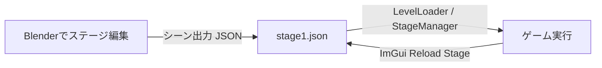

# レベルエディター（Blenderアドオン & レベルローダー）操作マニュアル

このドキュメントでは、Blenderアドオン（`Level_editer`）を使ってステージ・エネミー・レールなどを編集し、ゲーム側（`LevelLoader` / `StageManager`）で読み込んで反映させるまでの全手順を解説します。

---

## 1. 全体構造の概要

- **Blender側 (`Editer/Level_editer/`)**:
  - オブジェクトタイプ設定（地形、ブロック、敵、レール、トリガー等）
  - コライダー設定・モデル名・テクスチャ設定
  - シーン全体のJSONエクスポート
- **ゲーム側 (`application/level/`)**:
  - `LevelLoader`: JSONをDirectX座標系に自動変換してパース
  - `StageManager`: レール、敵、地形、ブロック、トリガーを実体化・統括
  - `GameScene`: 読み込んだ全オブジェクトの当たり判定・更新・描画を一括処理

---

## 2. Blender側での事前セットアップ（アドオンの有効化）

1. **Blenderを起動**します。
2. 上部メニューの **[編集 (Edit)] → [プリファレンス (Preferences)]** を開きます。
3. 左側の **[アドオン (Add-ons)]** を選択し、右上の **[インストール (Install...)]** ボタンをクリックします。
4. 本プロジェクト内の `Editer/Level_editer` フォルダ（または中身をまとめたzip）を選択してインストールします。
   - ※ スクリプトエディタから `Editer/Level_editer/__init__.py` を開いて **[スクリプト実行 (Run Script)]** でも有効化可能です。
5. リスト内の **「レベルエディタ」** にチェックを入れて有効化します。
6. 画面最上部のトップバーに **[MyMenu]** が追加され、オブジェクトプロパティに各種編集パネルが表示されれば準備完了です。

---

## 3. 各オブジェクトの配置・設定方法

### ① ステージ進行レール (`STAGE_RAIL`) / カメラレール (`CAMERA_RAIL`)
1. `Shift + A` → **[カーブ (Curve)] → [ベジェ (Bezier)]** を追加します。
2. 名前を `StageRail` または `CameraRail` に変更します。
3. 右側の **[オブジェクトプロパティ]** パネルで：
   - カスタムプロパティに `object_type` を追加し、値を `STAGE_RAIL` または `CAMERA_RAIL` に設定します。
   - レールをループさせる場合は、プロパティ `loop` (Boolean) を `true` にします。
4. `Tab` キーで **編集モード** に入り、制御点を移動・押し出し（`E`キー）してコースを作ります。
   > [!TIP]
   > 円形ステージの場合、半径20の円（4つの制御点と適切なハンドル）に設定することで、カービィ64のボス戦のような周回ステージが作成できます。

---

### ② 接地・壁判定ブロック (`BLOCK` / `StageBlock`)
プレイヤーが乗ったり壁として衝突したりできる直方体・直方体ブロックです。
1. `Shift + A` → **[メッシュ (Mesh)] → [立方体 (Cube)]** を配置します。
2. オブジェクトプロパティの **[Object Type Settings]** パネルでタイプを `BLOCK` に設定します。
3. プロパティまたは **[FileName]** パネルでモデル名を設定します：
   - 組み込みの直方体を使う場合: `file_name` = `"box"`
   - テクスチャを指定する場合: `texture` = `"resources/grass.png"`
4. 配置・スケール・回転を好みに合わせて調整します。
   - ゲーム側で自動的にワールド三角形ポリゴンが抽出され、プレイヤーの足場・壁判定になります。

---

### ③ 地形モデル (`TERRAIN`)
広大なステージ地面モデルなどを配置する場合に使用します。
1. メッシュオブジェクトを配置します。
2. タイプを `TERRAIN` に設定します。
3. カスタムプロパティを設定します：
   - `file_name`: `"TentativeStage.obj"` （モデルファイル名）
   - `model_dir`: `"resources/Stagemap"` （モデルフォルダ）
   - `texture`: `"resources/Stagemap/863603.png"` （テクスチャ画像）

---

### ④ エネミー配置 (`ENEMY`)
1. `Shift + A` → **[エンプティ (Empty)] → [十字 (Plain Axes)]** を配置します。
2. **[Object Type Settings]** パネルで **[ENEMYにする]** をクリックします。
3. 敵のタイプや配置パラメータをカスタムプロパティで指定します：
   - `enemy_type` (String):
     - `"Normal"` : 通常エネミー（`TestEnemy`）
     - `"Bound"` : バウンドエネミー（`BoundEnemy`）
   - `rail_pos` (配列またはプロパティ): `[進行度t, 高さy]`
     - 例: `[0.5, 0.0]` （レールの進行度0.5の位置、高さオフセット0）

---

### ⑤ プレイヤー開始位置 (`PLAYER_SPAWN`) / ゴール (`GOAL`)
1. `Shift + A` → **[エンプティ (Empty)]** を配置します。
2. 名前を `PlayerSpawn` または `Goal` に変更します。
3. カスタムプロパティ `object_type` を設定します：
   - プレイヤー開始位置: `PLAYER_SPAWN` （`rail_pos`: `[0.0, 0.0]`）
   - ゴール位置: `GOAL` （`rail_pos`: `[3.0, 2.0]` などレールの終端付近）

---

### ⑥ イベントトリガー (`TRIGGER`)
エリア通過・侵入を検知する透明なトリガー領域です。
1. `Shift + A` → **[エンプティ (Cube または Sphere)]** を配置します。
2. タイプを `TRIGGER` に設定します。
3. プロパティを設定します：
   - `event_name`: 発火させるイベント名（例: `"BossBattleStart"`, `"PlayBGM"`, `"TrapOpen"`）
   - `fire_mode`: `"once"` (1回のみ), `"continuous"` (侵入中毎フレーム), `"enter_exit"` (出入り時)
   - `collider_size`: 検知ボックスのサイズ

---

### ⑦ 物理ギミック (`PBD_ROPE` / `PBD_CLOTH`)
ロープや旗・布などのリアルタイム物理演算オブジェクトです。
1. エンプティまたはメッシュを配置し、タイプを `PBD_ROPE` または `PBD_CLOTH` に設定します。
2. プロパティで剛性（`stiffness`）、分割数（`num_points`）、重力（`gravity_y`）などを設定します。

---

## 4. JSONステージデータのエクスポート手順

1. Blender 上部メニューの **[MyMenu]** をクリックします。
2. **[シーン出力]** を選択します。
3. ファイル保存ダイアログが開くので、出力先を以下に指定して保存します：
   - **保存先パス**: `(プロジェクトフォルダ)/resources/Stagemap/stage1.json`
4. 画面下に「シーン情報をExportしました」と表示されれば成功です！

---

## 5. ゲーム内での確認・ホットリロード（即時反映）

1. ゲーム（Visual Studioからデバッグ実行）を起動します。
2. 起動時に `stage1.json` が自動的に読み込まれ、配置したレール・地形・エネミー・ゴールがそのまま画面に反映されます。

### 🔥 超便利機能：実行中の即座リロード（ホットリロード）
ゲームを起動したまま、Blender側で位置や敵の配置を修正して **[シーン出力]** で上書き保存した場合：
- ゲーム画面の ImGui **「Debug」** ウィンドウ内にある **[Reload Stage (stage1.json)]** ボタンをクリックするだけで、**ゲームを終了・再起動することなく一瞬で最新の配置に更新されます！**

---

## 6. カスタムプロパティ一覧（早見リファレンス）

| プロパティ名 | 型 | 設定例 | 説明 |
| :--- | :--- | :--- | :--- |
| `object_type` | String | `STAGE_RAIL`, `BLOCK`, `ENEMY` 等 | オブジェクトの基本役割 |
| `disabled` | Bool | `true` / `false` | `true` にすると一時的に配置を無効化 |
| `file_name` | String | `"box"`, `"TentativeStage.obj"` | 読み込む3Dモデル名 |
| `texture` | String | `"resources/grass.png"` | 貼り付けるテクスチャ画像パス |
| `enemy_type` | String | `"Normal"`, `"Bound"` | 敵の種類（ファクトリーに対応） |
| `rail_pos` | Array | `[0.5, 0.0]` | レール配置時の座標 `[t, y]` |
| `loop` | Bool | `true` / `false` | レールを周回ループさせるか |
| `event_name` | String | `"StageClear"` | トリガー発火時のイベント識別文字列 |
| `fire_mode` | String | `"once"`, `"continuous"`, `"enter_exit"` | トリガーの発火タイミング |
