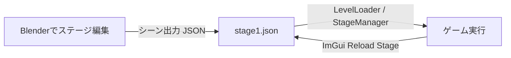

# レベルエディター（Blenderアドオン & レベルローダー）操作マニュアル

このドキュメントでは、Blenderアドオン（`Level_editer`）を使ってステージ・エネミー・レールなどを編集し、ゲーム側（`LevelLoader` / `StageManager`）で読み込んで反映させるまでの全手順を解説します。

---

## 1. 全体構造の概要

- **Blender側 (`Editer/Level_editer/`)**:
  - オブジェクトタイプ設定（地形、ブロック、敵、レール、トリガー等）
  - コライダー設定・モデル名・テクスチャ設定
  - シーン全体のJSONエクスポート
- **ゲーム側 (`application/level/`)**:
  - `LevelLoader`: JSONをDirectX座標系に自動変換してパース
  - `StageManager`: レール、敵、地形、ブロック、トリガーを実体化・統括
  - `GameScene`: 読み込んだ全オブジェクトの当たり判定・更新・描画を一括処理

---

## 2. Blender側でのセットアップ・更新方法

フォルダ管理やZIP圧縮の手間をなくし、**単一ファイル（`level_editor.py`）だけで読み込み・即時更新**できるようにしています。

### 🌟 おすすめ：Blenderのテキストエディタで即時実行（インストール不要・一発更新）
1. Blenderを起動し、上部の **[Scripting]** ワークスペース（またはテキストエディター画面）を開きます。
2. **[開く (Open)]** を押し、本プロジェクト内の **`Editer/level_editor.py`** を選択して開きます。
3. 画面上の **[▶ スクリプト実行 (Run Script)]** ボタン（またはキーボードの `Alt + P`）を押します。
4. **これだけで最新のメニュー（シーンロード・座標変換対応）が即座に反映されます！**
   - ※ 今後コードを変更した場合も、テキストエディタで [▶ スクリプト実行] を押すだけで一瞬で更新されます。

### アドオンとしてファイル単体をインストールする場合
1. Blenderの **[編集 (Edit)] → [プリファレンス (Preferences)] → [アドオン (Add-ons)]** を開きます。
2. 右上の **[インストール (Install...)]** ボタンをクリックします。
3. `Editer/level_editor.py` **ファイル単体を選択**してインストールします。
4. 一覧で「**レベルエディタ**」にチェックを入れます。

---

## 3. 各オブジェクトの配置・設定方法

### ① ステージ進行レール (`STAGE_RAIL`) / カメラレール (`CAMERA_RAIL`)
1. `Shift + A` → **[カーブ (Curve)] → [ベジェ (Bezier)]** を追加します。
2. 名前を `StageRail` または `CameraRail` に変更します。
3. 右側の **[オブジェクトプロパティ]** パネルで：
   - カスタムプロパティに `object_type` を追加し、値を `STAGE_RAIL` または `CAMERA_RAIL` に設定します。
   - レールをループさせる場合は、プロパティ `loop` (Boolean) を `true` にします。
4. `Tab` キーで **編集モード** に入り、制御点を移動・押し出し（`E`キー）してコースを作ります。
   > [!TIP]
   > 円形ステージの場合、半径20の円（4つの制御点と適切なハンドル）に設定することで、カービィ64のボス戦のような周回ステージが作成できます。

---

### ② 接地・壁判定ブロック (`BLOCK` / `StageBlock`)
プレイヤーが乗ったり壁として衝突したりできる直方体・直方体ブロックです。
1. `Shift + A` → **[メッシュ (Mesh)] → [立方体 (Cube)]** を配置します。
2. オブジェクトプロパティの **[Object Type Settings]** パネルでタイプを `BLOCK` に設定します。
3. プロパティまたは **[FileName]** パネルでモデル名を設定します：
   - 組み込みの直方体を使う場合: `file_name` = `"box"`
   - テクスチャを指定する場合: `texture` = `"resources/grass.png"`
4. 配置・スケール・回転を好みに合わせて調整します。
   - ゲーム側で自動的にワールド三角形ポリゴンが抽出され、プレイヤーの足場・壁判定になります。

---

### ③ 地形モデル (`TERRAIN`)
広大なステージ地面モデルなどを配置する場合に使用します。
1. メッシュオブジェクトを配置します。
2. タイプを `TERRAIN` に設定します。
3. カスタムプロパティを設定します：
   - `file_name`: `"TentativeStage.obj"` （モデルファイル名）
   - `model_dir`: `"resources/Stagemap"` （モデルフォルダ）
   - `texture`: `"resources/Stagemap/863603.png"` （テクスチャ画像）

---

### ④ エネミー配置 (`ENEMY`)
エディター上では、単なる十字軸ではなく**ゲームと同じ敵モデル（`taru.obj` / 樽）が3Dメッシュとして自動描画**されます！
1. `Shift + A` → **[エンプティ]** または **[メッシュ]** を配置します。
2. **[Object Type Settings]** パネルで **[ENEMYにする]** をクリックします。
   - 自動的に敵モデル（樽）が割り当てられ、3Dビュー上で見た目や向きが直感的に確認できます。
3. 敵のタイプや配置パラメータをカスタムプロパティで指定します：
   - `enemy_type` (String):
     - `"Normal"` : 通常エネミー（`TestEnemy`）
     - `"Bound"` : バウンドエネミー（`BoundEnemy`）
   - `rail_pos`: `[進行度t, 高さy]`（マグネット吸着で自動設定されます）

---

### ⑤ プレイヤー開始位置 (`PLAYER_SPAWN`) / ゴール (`GOAL`)
エディター上でも**プレイヤーの3Dモデル（`player.obj`）やゴール（`goal.obj`）がメッシュとして表示**されます！
1. オブジェクトを配置し、名前を `PlayerSpawn` または `Goal` に変更します。
2. **[Object Type Settings]** パネルで **[PLAYERにする]** または **[GOALにする]** をクリックします。
   - 自動的にプレイヤーモデルまたはゴールモデルが適用されます。
3. レール進行度を設定します：
   - プレイヤー開始位置: `PLAYER_SPAWN` （`rail_pos`: `[0.0, 0.0]`）
   - ゴール位置: `GOAL` （`rail_pos`: `[3.0, 2.0]` などレールの終端付近）

> [!TIP]
> **モデルのゲーム座標系からBlender座標系への自動変換**
> リソースフォルダ内のモデル（`taru.obj`, `player.obj`, `goal.obj`, `TentativeStage.obj` など）はゲーム（DirectX: Y-up, Z-奥）向けに作成されていますが、エディター側で読み込む際に**自動的にBlender座標系（Z-up, Y-奥）へ軸変換・法線補正**されて生成されます。そのため、モデルが倒れて寝てしまったり前後が逆になることなく、正しい天地・向きで表示されます！
>
> **既に開いているシーンで十字軸（Empty）のまま表示されている場合**
> 上部メニュー **[MyMenu] → [全Enemy/Playerをモデル表示に更新]** を押すだけで、シーン内の全敵・プレイヤー・ゴールが一瞬でBlender座標系に合わせた3Dモデルメッシュ表示に切り替わります！

---

### ⑥ イベントトリガー (`TRIGGER`)
エリア通過・侵入を検知する透明なトリガー領域です。
1. `Shift + A` → **[エンプティ (Cube または Sphere)]** を配置します。
2. タイプを `TRIGGER` に設定します。
3. プロパティを設定します：
   - `event_name`: 発火させるイベント名（例: `"BossBattleStart"`, `"PlayBGM"`, `"TrapOpen"`）
   - `fire_mode`: `"once"` (1回のみ), `"continuous"` (侵入中毎フレーム), `"enter_exit"` (出入り時)
   - `collider_size`: 検知ボックスのサイズ

---

### ⑦ 物理ギミック (`PBD_ROPE` / `PBD_CLOTH`)
ロープや旗・布などのリアルタイム物理演算オブジェクトです。
1. エンプティまたはメッシュを配置し、タイプを `PBD_ROPE` または `PBD_CLOTH` に設定します。
2. プロパティで剛性（`stiffness`）、分割数（`num_points`）、重力（`gravity_y`）などを設定します。

---

## 4. JSONステージデータのエクスポート・インポート手順

### ① シーン出力（エクスポート: Blender座標 → ゲーム座標）
1. Blender 上部メニューの **[MyMenu]** をクリックします。
2. **[シーン出力]** を選択します。
3. 保存ダイアログが開きます。
   - **「ゲーム座標系に変換 (Blender -> Game)」** にチェック（デフォルトON）が入っていることを確認します。
     - Blenderの座標系（X右, Y奥, Z上）からゲーム（DirectX）座標系（X右, Y上, Z奥）へ自動変換されて保存されます。
     - レール（CURVE）やコライダーの配置もすべてゲーム座標系に自動変換されます。
4. 出力先を指定して保存します：
   - **保存先パス**: `(プロジェクトフォルダ)/resources/Stagemap/stage1.json`
5. 画面下に「シーン情報をExportしました」と表示されれば成功です！

### ② シーンロード（インポート: ゲーム座標 → Blender座標 & レール自動配置）
出力済みのステージJSONをBlenderに再読み込みして復元・編集する場合に使用します。
1. Blender 上部メニューの **[MyMenu]** をクリックします。
2. **[シーンロード]** を選択します。
3. ファイル選択ダイアログで読み込みたい JSON ファイル（例: `stage1.json`）を選択します。
   - **「ゲーム座標系から変換 (Game -> Blender)」**: チェック（デフォルトON）を入れると、ゲーム座標系のステージ配置がBlender座標系に逆変換されて正しく配置されます。
   - **「rail_pos をレール上に自動配置」**: チェック（デフォルトON）を入れると、`PlayerSpawn` や `Enemy`, `Goal` など `rail_pos` を持つオブジェクトが、Blender上のベジェレール（CURVE）から進行度 $t$ を自動計算してゲームと全く同じレール上の位置にスナップ配置されます。
   - **「既存オブジェクトを上書き」**: 同名オブジェクトが存在する場合に削除して再生成します。
4. **[シーンロード]** ボタンをクリックすると、シーン内にレール、ブロック、敵などのオブジェクトが配置され、Emptyが自動的にレール上の正しい位置へ整列します。

---

### ③ レール配置パネル (Rail Position Settings) の使い方
敵やプレイヤーなどのEmptyオブジェクトを選択すると、右側のプロパティに **[Rail Position Settings]** パネルが表示されます。

- **🧲 レール自動吸着 (近づくと吸着)**:
  - **自動吸着モード (デフォルト: ON)**:
    - 3Dビュー上でEmptyをドラッグ移動（`G` キー等）してレールの近くに持っていくと、**吸着距離（デフォルト3.0m）以内に入った瞬間にピタッとレール上の正確な位置に自動吸い寄せられてスナップ**します！
    - 同時に `rail_pos`（進行度 $t$）もリアルタイムに自動更新されます。
    - ボタンを毎回押す必要すらなく、直感的に敵をレール沿いに並べることができます。
  - **吸着距離 (m)**: 吸い付く判定距離を自由に調整できます。
  - **現在の高さを維持**: オブジェクトの現在のZ高さをキープしたままレールに吸着させるか（デフォルトON）を設定できます。
- **レール位置へスナップ (Snap to Rail)**:
  - 設定されている `rail_pos: [t, y]` に基づき、いつでもオブジェクトをレール上の正確な位置へ再配置します。
- **現在地から逆算 (Calculate rail_pos)**:
  - 手動でボタンを押して最寄りレール位置を逆算・スナップさせたい場合に使用します。

---

## 5. ゲーム内での確認・ホットリロード（即時反映）

1. ゲーム（Visual Studioからデバッグ実行）を起動します。
2. 起動時に `stage1.json` が自動的に読み込まれ、配置したレール・地形・エネミー・ゴールがそのまま画面に反映されます。

### 🔥 超便利機能：実行中の即座リロード（ホットリロード）
ゲームを起動したまま、Blender側で位置や敵の配置を修正して **[シーン出力]** で上書き保存した場合：
- ゲーム画面の ImGui **「Debug」** ウィンドウ内にある **[Reload Stage (stage1.json)]** ボタンをクリックするだけで、**ゲームを終了・再起動することなく一瞬で最新の配置に更新されます！**

---

## 6. カスタムプロパティ一覧（早見リファレンス）

| プロパティ名 | 型 | 設定例 | 説明 |
| :--- | :--- | :--- | :--- |
| `object_type` | String | `STAGE_RAIL`, `BLOCK`, `ENEMY` 等 | オブジェクトの基本役割 |
| `disabled` | Bool | `true` / `false` | `true` にすると一時的に配置を無効化 |
| `file_name` | String | `"box"`, `"TentativeStage.obj"` | 読み込む3Dモデル名 |
| `texture` | String | `"resources/grass.png"` | 貼り付けるテクスチャ画像パス |
| `enemy_type` | String | `"Normal"`, `"Bound"` | 敵の種類（ファクトリーに対応） |
| `rail_pos` | Array | `[0.5, 0.0]` | レール配置時の座標 `[t, y]` |
| `loop` | Bool | `true` / `false` | レールを周回ループさせるか |
| `event_name` | String | `"StageClear"` | トリガー発火時のイベント識別文字列 |
| `fire_mode` | String | `"once"`, `"continuous"`, `"enter_exit"` | トリガーの発火タイミング |
