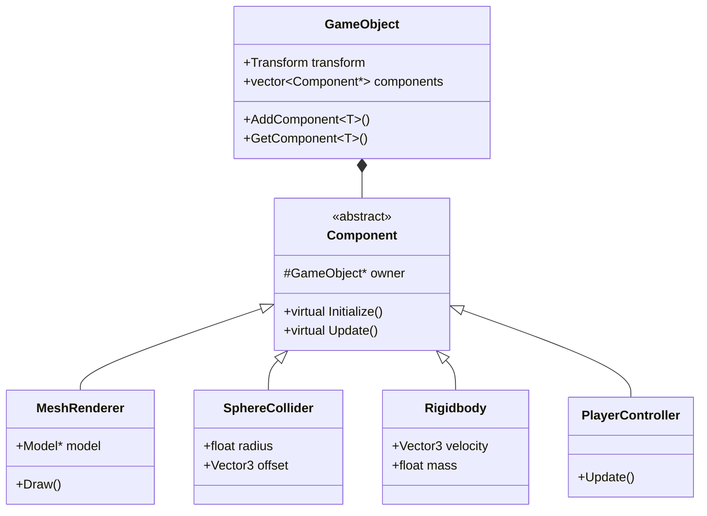
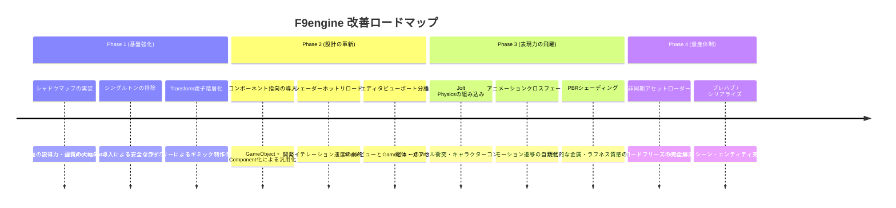

# 自作ゲームエンジン（F9engine）と商用エンジン（Unity / Unreal Engine）の徹底比較・改善ロードマップ

本ドキュメントは、DirectX 12を用いて独自開発されているゲームエンジン（以下 **F9engine**）と、業界標準の商用ゲームエンジン（**Unity** / **Unreal Engine 5**）を比較し、**「何が足りないのか」「どのような設計に寄せていくべきなのか」** を技術的・構造的観点から網羅的に整理した比較・改善設計書です。

---

## 目次
1. [はじめに：自作エンジンの現在の達成度](#1-はじめに自作エンジンの現在の達成度)
2. [全体比較マトリクス](#2-全体比較マトリクス)
3. [アーキテクチャ・設計思想（寄せるべき最重要箇所）](#3-アーキテクチャ設計思想寄せるべき最重要箇所)
   - 3.1 [シングルトンの過剰依存 vs エンジンコンテキスト / サブシステム](#31-シングルトンの過剰依存-vs-エンジンコンテキスト--サブシステム)
   - 3.2 [継承ベースの巨大クラス vs コンポーネント指向（ECS / Actor-Component）](#32-継承ベースの巨大クラス-vs-コンポーネント指向ecs--actor-component)
   - 3.3 [親子階層・シーングラフの欠如 vs トランスフォーム階層構造](#33-親子階層シーングラフの欠如-vs-トランスフォーム階層構造)
   - 3.4 [エンジン層とアプリケーション層の境界曖昧さ](#34-エンジン層とアプリケーション層の境界曖昧さ)
4. [レンダリング・グラフィックス機能（不足要素と改善）](#4-レンダリンググラフィックス機能不足要素と改善)
   - 4.1 [フォワードレンダリングの限界 vs ディファード / クラスタードレンダリング](#41-フォワードレンダリングの限界-vs-ディファード--クラスタードレンダリング)
   - 4.2 [固定ライト数とシャドウマップ（影）の欠如](#42-固定ライト数とシャドウマップ影の欠如)
   - 4.3 [PBR（物理ベースレンダリング）とマテリアル抽象化](#43-pbr物理ベースレンダリングとマテリアル抽象化)
   - 4.4 [ポストプロセスパイプラインの統一（ボリューム方式）](#44-ポストプロセスパイプラインの統一ボリューム方式)
   - 4.5 [ビューポート分離（Sceneビュー vs Gameビュー）](#45-ビューポート分離sceneビュー-vs-gameビュー)
5. [物理演算・コリジョンシステム（不足要素と改善）](#5-物理演算コリジョンシステム不足要素と改善)
   - 5.1 [全探索判定 vs 空間分割ブロードフェーズ（BVH / SAP）](#51-全探索判定-vs-空間分割ブロードフェーズbvh--sap)
   - 5.2 [球・レイのみ vs 複合コライダー（Box, Capsule, Convex Mesh）](#52-球レイのみ-vs-複合コライダーbox-capsule-convex-mesh)
   - 5.3 [幾何交差判定 vs 剛体物理（RigidBody）・連続衝突判定（CCD）](#53-幾何交差判定-vs-剛体物理rigidbody連続衝突判定ccd)
   - 5.4 [オープンソース物理エンジン（Jolt Physics）の導入提案](#54-オープンソース物理エンジンjolt-physicsの導入提案)
6. [アニメーションシステム（不足要素と改善）](#6-アニメーションシステム不足要素と改善)
   - 6.1 [単一トラック再生 vs ブレンドツリー & ステートマシン](#61-単一トラック再生-vs-ブレンドツリー--ステートマシン)
   - 6.2 [ルートモーションとインバースキネマティクス（IK）](#62-ルートモーションとインバースキネマティクスik)
7. [アセット管理・リソースパイプライン（不足要素と改善）](#7-アセット管理リソースパイプライン不足要素と改善)
   - 7.1 [メインスレッド同期読み込み vs 非同期ストリーミング・GUID管理](#71-メインスレッド同期読み込み-vs-非同期ストリーミングguid管理)
   - 7.2 [プレハブ（Prefab）/ ブループリント（Blueprint）アーキテクチャ](#72-プレハブprefab-ブループリントblueprintアーキテクチャ)
8. [エディタ・開発環境・ツール（不足要素と改善）](#8-エディタ開発環境ツール不足要素と改善)
   - 8.1 [インゲームデバッグGUI vs 本格エディタUI（インスペクタ、ヒエラルキー）](#81-インゲームデバッグgui-vs-本格エディタuiインスペクタヒエラルキー)
   - 8.2 [プレイ／ポーズ／コマ送り実行とワールドシミュレーションの分離](#82-プレイポーズコマ送り実行とワールドシミュレーションの分離)
   - 8.3 [ホットリロード（シェーダー・C++コード）](#83-ホットリロードシェーダーcコード)
9. [オーディオ・入力・UIシステム（不足要素）](#9-オーディオ入力uiシステム不足要素)
10. [段階的改善ロードマップ（どこから寄せるべきか）](#10-段階的改善ロードマップどこから寄せるべきか)

---

## 1. はじめに：自作エンジンの現在の達成度

本リポジトリのコードベース（[`engine/`](file:///c:/Users/k024g/OneDrive/デスクトップ/study/3nenn/AL/Project/project/engine)）を調査すると、以下のハイレベルな基盤が既に実装されています：
- **DirectX 12基盤**: コマンドリスト・キュー、スワップチェーン、記述子ヒープ（SRV/RTV/DSV）、パイプラインステート（PSO）の自作カプセル化（[`DXCommon.h`](file:///c:/Users/k024g/OneDrive/デスクトップ/study/3nenn/AL/Project/project/engine/base/DXCommon.h), [`PSOManager.h`](file:///c:/Users/k024g/OneDrive/デスクトップ/study/3nenn/AL/Project/project/engine/base/PSOManager.h), [`SrvManager.h`](file:///c:/Users/k024g/OneDrive/デスクトップ/study/3nenn/AL/Project/project/engine/base/SrvManager.h)）
- **ポストプロセス機構**: オフスクリーンレンダーターゲット、マルチパス合成、多彩なシェーダー（Dissolve, RadialBlur, GaussianFilter, Vignettingなど）（[`OffScreen.h`](file:///c:/Users/k024g/OneDrive/デスクトップ/study/3nenn/AL/Project/project/engine/base/OffScreen.h)）
- **3Dモデル・アニメーション**: Assimpを用いたGLTF/OBJ等のロード、ボーンアニメーション行列計算（[`Model.h`](file:///c:/Users/k024g/OneDrive/デスクトップ/study/3nenn/AL/Project/project/engine/3d/Model.h), [`Animation.h`](file:///c:/Users/k024g/OneDrive/デスクトップ/study/3nenn/AL/Project/project/engine/3d/Animation.h)）
- **GUIツール**: ImGuiおよびImGuizmoによるオブジェクト移動ギズモの統合（[`ImGuiManager.h`](file:///c:/Users/k024g/OneDrive/デスクトップ/study/3nenn/AL/Project/project/engine/Tool/ImGuiManager.h)）

**結論として、自主制作・学習用DirectX 12エンジンとしては極めて優秀な技術水準にあります。**
しかし、**「商用ゲームエンジン（Unity/Unreal Engine）」と対比した場合は、主に『アーキテクチャの柔軟性』『汎用的なツールチェーン』『拡張性・保守性』において大きな隔たり**があります。

---

## 2. 全体比較マトリクス

| 評価分野 | F9engine（現状） | Unity | Unreal Engine 5 | 商用エンジンに寄せる優先度 |
| :--- | :--- | :--- | :--- | :--- |
| **設計パターン** | シングルトン多用・密結合 | Service Locator / DI | World Subsystem / Context | **極めて高い（破綻防止）** |
| **オブジェクト設計** | 巨大ベースクラスの単一継承 | GameObject + Component | AActor + UActorComponent | **極めて高い（量産性向上）** |
| **シーングラフ** | 各オブジェクトが孤立 | Transform親子階層（ローカル/ワールド） | USceneComponent階層 | **高い（乗り物・部位表現）** |
| **ライティング** | 固定最大数（Dir3, Point3, Spot3） | Forward+ / Deferred / Clustered | Deferred / Lumen（GI+Reflection） | **中（将来的な拡張）** |
| **シャドウ** | 未実装 | カスケードシャドウマップ (CSM) | Virtual Shadow Maps (VSM) | **高い（画質向上に直結）** |
| **物理演算** | 球 vs 球, 自作レイキャスト | PhysX / Unity Physics (Jolt等) | Chaos Physics (旧PhysX) | **高い（ゲーム性向上）** |
| **アニメーション** | 単一クリップ再生のみ | Mecanim (ブレンドツリー, ステートマシン) | Control Rig, AnimMontage, StateMachine | **中（表現力向上）** |
| **アセット読み込み** | メインスレッド同期ロード | 非同期ロード, Addressables | 非同期ストリーミング, Nanite | **中（ロード停止解消）** |
| **エディタ環境** | ゲーム画面にImGui重ね合わせ | 完全分離エディタ（Scene/Game独立） | 完全分離エディタ（Level Editor） | **高い（レベルデザイン効率）** |

---

## 3. アーキテクチャ・設計思想（寄せるべき最重要箇所）

### 3.1 シングルトンの過剰依存 vs エンジンコンテキスト / サブシステム

#### 現状の問題点
- [`DXCommon`](file:///c:/Users/k024g/OneDrive/デスクトップ/study/3nenn/AL/Project/project/engine/base/DXCommon.h), [`SrvManager`](file:///c:/Users/k024g/OneDrive/デスクトップ/study/3nenn/AL/Project/project/engine/base/SrvManager.h), [`LightManager`](file:///c:/Users/k024g/OneDrive/デスクトップ/study/3nenn/AL/Project/project/engine/Tool/LightManager.h), [`CollisionManager`](file:///c:/Users/k024g/OneDrive/デスクトップ/study/3nenn/AL/Project/project/application/Collision/CollisionManager.h), [`SceneManager`](file:///c:/Users/k024g/OneDrive/デスクトップ/study/3nenn/AL/Project/project/engine/scene/SceneManager.h) など、全システムが `::GetInstance()` の静的グローバル呼び出しになっています。
- **弊害**:
  1. **依存関係の不可視化**: ヘッダーの関数宣言を見ただけでは何に依存しているか分からず、内部でグローバル変数を参照してしまいます。
  2. **初期化・破棄順序の未定義クラッシュ**: 終了処理時にどのマネージャから破棄すべきかが曖昧になり、DirectX 12のデバッグレイヤーでリソースリークやクラッシュが発生します。
  3. **マルチワールド・マルチビューポートの制限**: 2画面分割、エディタ用プレビュー画面、UI用別ワールドを作ろうとした際に、グローバル変数が衝突して作成できません。

#### 商用エンジンへの寄せ方
- **Unreal Engineの流儀（Subsystem / WorldContext）**:
  エンジンレベルで1つ存在する「EngineSubsystem」と、シーン/ワールド毎に生成・破棄される「WorldSubsystem」を明確に分けます。
- **導入すべき構造（EngineContext方式）**:
  ```cpp
  // 全マネージャから GetInstance() を剥がし、EngineContextが所有
  struct EngineContext {
      DXCommon* dxCommon = nullptr;
      SrvManager* srvManager = nullptr;
      PSOManager* psoManager = nullptr;
      TextureManager* textureManager = nullptr;
      ModelManager* modelManager = nullptr;
  };

  // ワールド・シーン毎のデータ（シーン破棄時に自動的に全消滅）
  struct WorldContext {
      Camera* mainCamera = nullptr;
      LightManager* lightManager = nullptr;
      CollisionManager* collisionManager = nullptr;
  };
  ```

---

### 3.2 継承ベースの巨大クラス vs コンポーネント指向（ECS / Actor-Component）

#### 現状の問題点
- [`GameObject.h`](file:///c:/Users/k024g/OneDrive/デスクトップ/study/3nenn/AL/Project/project/application/Collision/GameObject.h) に `Collider`, `Ray`, `GroundRayPalamata`, `RayTriangleCollisionResult`, `CollisionCategory` など、あらゆる機能が直接書き込まれています。
- さらに派生クラスの [`Player.h`](file:///c:/Users/k024g/OneDrive/デスクトップ/study/3nenn/AL/Project/project/application/object/player/Player.h) に `RailMover`, `Audio`, `Camera`, `Object3d` がベタ持ちされています。
- **弊害**:
  - 「動かない背景オブジェクト」にも接地レイ判定やカテゴリなどの無駄なメモリ・変数が乗る。
  - 「弾」「敵」「乗り物」など新しいオブジェクトを作るたびに、基底クラスを修正するか、多重継承・複雑な階層構造に陥る。

#### 商用エンジンへの寄せ方（Unity / UEの設計思想）
- **オブジェクトは「空の入れ物（Entity / Actor）」**とし、振る舞いはすべて**コンポーネント（Component）を着脱する**形式にします。



---

### 3.3 親子階層・シーングラフの欠如 vs トランスフォーム階層構造

#### 現状の問題点
- 各オブジェクトはワールド座標（Translate, Rotate, Scale）を直接持っており、**「親のトランスフォーム」に追従する仕組み（シーングラフ）**がエンジンレベルで標準化されていません。
- 例えば「プレイヤーが動くリフトに乗る」「プレイヤーの手に武器を持たせる」「戦車の砲塔を車体上で旋回させる」といった処理を、自前で個別計算（手動で行列を乗算）しなければなりません。

#### 商用エンジンへの寄せ方
- Unityの `Transform`、UEの `USceneComponent` と同様に、Transformに行列の階層計算を内蔵します。
- **トランスフォームの標準実装**:
  ```cpp
  class Transform {
  public:
      Vector3 localPosition = {0, 0, 0};
      Quaternion localRotation = {0, 0, 0, 1};
      Vector3寄存localScale = {1, 1, 1};

      Transform* parent = nullptr;
      std::vector<Transform*> children;

      // 親の行列を再帰的に掛け合わせてワールド行列を算出（ダーティフラグで最適化）
      Matrix4x4 GetWorldMatrix() {
          if (isDirty_) {
              Matrix4x4 local = Matrix4x4::Affine(localScale, localRotation, localPosition);
              worldMatrix_ = parent ? (local * parent->GetWorldMatrix()) : local;
              isDirty_ = false;
          }
          return worldMatrix_;
      }
  private:
      Matrix4x4 worldMatrix_;
      bool isDirty_ = true;
  };
  ```

---

### 3.4 エンジン層とアプリケーション層の境界曖昧さ

#### 現状の問題点
- [`application/Collision/GameObject.h`](file:///c:/Users/k024g/OneDrive/デスクトップ/study/3nenn/AL/Project/project/application/Collision/GameObject.h) のように、汎用的なゲームオブジェクトの基底や当たり判定マネージャが `application/` 側に配置されています。
- 一方、`engine/` 側からもアプリケーション固有の型を参照しようとしたり、依存の方向が双方向になりがちです。

#### 商用エンジンへの寄せ方
- **依存の原則**: `Application` ➔ `Engine` の一方向のみを許可し、`Engine` は `Application` のヘッダーを一切インクルードしない（クリーンアーキテクチャ）。
- コリジョン、オブジェクト基底、数学、レンダラーはすべて `engine/` に移動し、ゲーム固有のルール（Player, Enemy, Goalなど）のみを `application/` に残します。

---

## 4. レンダリング・グラフィックス機能（不足要素と改善）

### 4.1 フォワードレンダリングの限界 vs ディファード / クラスタードレンダリング

- **現状**:
  フォワードレンダリング（Forward Rendering）方式。1つのメッシュ描画時に、すべてのライト（平行光3+点光源3+スポット光3）の計算をシェーダー内でループ実行。
- **商用エンジン（UE5 / Unity URP・HDRP）**:
  - **UE5 / Unity HDRP**: **ディファードレンダリング（Deferred Rendering）**
    - G-Buffer（Albedo, Normal, Roughness, Metalness, Depth）をレンダーターゲットに出力し、画面に映っているピクセルにのみライティングを適用（ライト数が数百個になっても極めて高速）。
  - **Unity URP / Modern Forward**: **クラスタードフォワード（Clustered Forward Rendering）**
    - 画面を3D空間（X, Y, 深度Z）のクラスタに分割し、影響するライトのみをピクセルに渡す。
- **寄せるべき方針**:
  現在の自作エンジン規模であれば、無理に完全ディファードにするよりも、まず**Forward+（タイルドフォワード/クラスタード）の概念**を取り入れるか、後述の**シャドウマップの実装**を最優先すべきです。

---

### 4.2 固定ライト数とシャドウマップ（影）の欠如

- **現状**:
  - [`LightManager.h`](file:///c:/Users/k024g/OneDrive/デスクトップ/study/3nenn/AL/Project/project/engine/Tool/LightManager.h) で `kNumDirectionalLights = 3`, `kNumPointLights = 3`, `kNumSpotLights = 3` と定数固定。
  - **シャドウマップ（陰影計算・深度影）が存在しない**。オブジェクトが地面に浮いて見えたり、立体感が損なわれる最大の原因。
- **商用エンジン**:
  - カスケードシャドウマップ（CSM: Cascaded Shadow Maps）により、近景は高精細、遠景は広範囲に影を落とす。
  - PCF（Percentage Closer Filtering）によるソフトシャドウ。
- **寄せるべき方針**:
  1. ライト視点からの深度テクスチャを描画する専用PSOとレンダーパスを追加。
  2. メイン描画時にライト空間の座標変換行列を定数バッファで渡し、深度比較を行って影を描画（これだけで劇的に商用エンジン級の見た目になります）。

---

### 4.3 PBR（物理ベースレンダリング）とマテリアル抽象化

- **現状**:
  Lambert / Blinn-Phong 反射モデルを中心としたクラシックなライティング。
- **商用エンジン**:
  - **ディズニー・プリンシプルBRDF（Metallic-Roughnessワークフロー）**:
    - BaseColor（アルベド）
    - Metallic（金属性 0:非金属, 1:金属）
    - Roughness（粗さ 0:滑らか, 1:粗い）
    - NormalMap（法線マップ）
  - IBL（Image Based Lighting）による環境光の映り込み。
- **寄せるべき方針**:
  Cook-TorranceマイクロファセットBRDF（GGX分布）のピクセルシェーダーを実装し、GLTFから Metallic-Roughness テクスチャを読み込んでシェーディングを行う。

---

### 4.4 ポストプロセスパイプラインの統一（ボリューム方式）

- **現状**:
  [`OffScreen.h`](file:///c:/Users/k024g/OneDrive/デスクトップ/study/3nenn/AL/Project/project/engine/base/OffScreen.h) にてシェーダーごとに個別の関数やレンダーパスがハードコードされている。
- **商用エンジン（Unity Post-Processing Stack / UE PostProcessVolume）**:
  - 画面全体のトーンマッピング、ブルーム、被写界深度（DoF）、色補正などを**「エフェクトの配列（スタック）」**として順次適用する共通パイプライン。
  - エリア（ボリューム）に入ることでパラメータが滑らかにブレンドされる。
- **寄せるべき方針**:
  ポストエフェクトを `IPostEffect` インターフェース化し、`PostProcessPipeline` に登録されたエフェクトを順にフルスクリーン描画（Ping-Pongレンダーターゲット）する構造にリファクタリング。

---

### 4.5 ビューポート分離（Sceneビュー vs Gameビュー）

- **現状**:
  ゲームのバックバッファに対して直接ImGuiを描画し、カメラもゲームのカメラと兼用、またはトグル切り替え。
- **商用エンジン**:
  - **Scene View（エディタ用自由カメラ・ギズモ操作）**
  - **Game View（ゲーム内カメラ・ポストプロセス適用画面）**
  これらが別々のレンダーターゲットテクスチャとしてImGui等のウィンドウ内に独立して描画される。
- **寄せるべき方針**:
  [`OffScreen`](file:///c:/Users/k024g/OneDrive/デスクトップ/study/3nenn/AL/Project/project/engine/base/OffScreen.h) のレンダーターゲットを `ImGui::Image` に渡し、ImGuiのウィンドウ内に描画することで、エディタUIとゲーム画面を完全分離する。

---

## 5. 物理演算・コリジョンシステム（不足要素と改善）

### 5.1 全探索判定 vs 空間分割ブロードフェーズ（BVH / SAP）

- **現状**:
  [`CollisionManager.cpp`](file:///c:/Users/k024g/OneDrive/デスクトップ/study/3nenn/AL/Project/project/application/Collision/CollisionManager.cpp) にて、全コライダー同士の二重ループ（$O(N^2)$）。`kBroadPhaseMaxDistanceSq` による単純距離チェックはあるものの、オブジェクト数が増えると処理落ちする。
- **商用エンジン**:
  - **ブロードフェーズ（Broad-phase）**: BVH（Bounding Volume Hierarchy）、八分木（Octree）、Sweep and Prune（SAP）などを用いて、$O(N \log N)$ 以下で衝突候補を高速枝刈り。
  - **ナローフェーズ（Narrow-phase）**: 絞り込まれたペアのみで詳細な幾何交差計算。

---

### 5.2 球・レイのみ vs 複合コライダー（Box, Capsule, Convex Mesh）

- **現状**:
  コライダーは球（Sphere）とレイキャスト（Ray）が主軸。人型キャラクターの足元や壁の判定をレイの複数照射で代用している。
- **商用エンジン**:
  - **Box Collider (OBB / AABB)**
  - **Capsule Collider**: キャラクター制御に必須（階段をスムーズに登れる、引っかかりにくい）。
  - **Convex Hull (凸包メッシュ)**, **Triangle Mesh Collider (静的地面用)**.

---

### 5.3 幾何交差判定 vs 剛体物理（RigidBody）・連続衝突判定（CCD）

- **現状**:
  「当たった」というイベント（`OnCollision`）を検知し、座標を手動で押し戻す（Kinematicなアプローチ）。反発係数、摩擦、質量、重力、トルクの物理積分はない。
- **商用エンジン**:
  - **RigidBody（剛体シミュレーション）**: ニュートンの運動方程式に基づき、速度・角速度・衝撃力（Impulse）を物理エンジンが自動解決。
  - **CCD（Continuous Collision Detection）**: 高速移動する弾などが壁をすり抜ける（トンネリング現象）のを防ぐスイープ判定。

---

### 5.4 オープンソース物理エンジン（Jolt Physics）の導入提案

- **自作の限界**:
  本格的な剛体物理、キャラクターコントローラー、複合メッシュ衝突を自前でゼロから実装するのは極めて難易度が高く、膨大な工数を要します。
- **推奨アプローチ**:
  - 近年の商用ゲーム（『Horizon Forbidden West』等）でも採用されている最新の高速C++物理エンジン **[Jolt Physics](https://github.com/jrouwe/JoltPhysics)** の統合を推奨します。
  - DirectX 12との親和性が高く、依存ライブラリなし、マルチスレッドネイティブ対応で、Unity/UE同等の物理挙動が手に入ります。

---

## 6. アニメーションシステム（不足要素と改善）

### 6.1 単一トラック再生 vs ブレンドツリー & ステートマシン

- **現状**:
  [`Animation.cpp`](file:///c:/Users/k024g/OneDrive/デスクトップ/study/3nenn/AL/Project/project/engine/3d/Animation.cpp) にて、ロードしたアニメーションの時間を進めてボーン行列を補間計算し、メッシュに適用。
- **商用エンジン**:
  - **クロスフェード（Cross-fade）**: 「走る」から「ジャンプ」に移る際、姿勢が瞬時に切り替わらず0.2秒かけて滑らかに補間遷移する。
  - **ブレンドツリー（Blend Tree）**: 「歩き」と「走り」を移動速度（Float）に応じてブレンドする（アニメーション同士の足し算）。
  - **アニメーションステートマシン（ASM）**: Idle ⇄ Run ⇄ Jump などの遷移ルールをグラフ構造で管理。

---

### 6.2 ルートモーションとインバースキネマティクス（IK）

- **商用エンジンの必須要素**:
  - **ルートモーション（Root Motion）**: アニメーションデータの移動量をそのままTransformの移動として反映（足滑りを防止）。
  - **IK（Two-Bone IK / FABRIK）**: 坂道や階段で足が地面にめり込まず、正確に地面に接地するよう足の関節角度をリアルタイム補正。

---

## 7. アセット管理・リソースパイプライン（不足要素と改善）

### 7.1 メインスレッド同期読み込み vs 非同期ストリーミング・GUID管理

- **現状**:
  - テクスチャやモデルのロードをゲームループ中のメインスレッドで実行しているため、大容量アセットの読み込み時に画面が一瞬停止（フリーズ）する。
  - ファイルパス（`"resources/player/player.obj"` 等の文字列）でリソースを一意管理しているため、ファイルを移動すると参照が壊れる。
- **商用エンジン**:
  - **GUID管理**: アセットにUUID（固有ID）と `.meta` ファイルを付与し、パスが変わっても参照が壊れない。
  - **非同期ローダー（Async Loading）**: バックグラウンドスレッド（Worker Thread）でディスクから読み込み、完了通知を受け取ってGPUにコピー。

---

### 7.2 プレハブ（Prefab）/ ブループリント（Blueprint）アーキテクチャ

- **現状**:
  敵のパラメータ、モデル、初期コライダー設定などがC++コード内（ハードコード）または専用のJSONパーサーで個別に読み込まれている。
- **商用エンジン**:
  - オブジェクトの設定（構成コンポーネント、マテリアル、パラメータ）を1つの再利用可能なアセット（Prefab / Blueprint）としてシリアライズ・保存・再利用できる。

---

## 8. エディタ・開発環境・ツール（不足要素と改善）

### 8.1 インゲームデバッグGUI vs 本格エディタUI

- **現状**:
  ゲーム描画の上にImGuiウィンドウを表示し、リアルタイムに数値をいじる構造。
- **商用エンジン**:
  - **Hierarchy（ヒエラルキー）**: シーン内の全オブジェクトの親子ツリー表示。
  - **Inspector（インスペクタ）**: 選択したオブジェクトのコンポーネント・メンバ変数を自動リフレクションでGUI化。
  - **Undo / Redo（操作取り消し）**: オブジェクトの移動やパラメータ変更を取り消せるコマンドパターン。

---

### 8.2 プレイ／ポーズ／コマ送り実行とワールドシミュレーションの分離

- **現状**:
  常にゲームループが回っており、「エディタ上で配置作業をして、Playボタンを押した時だけ物理やAIが動き出し、Stopボタンで配置状態に巻き戻る」というワークフローがない。
- **商用エンジン**:
  - **Editor World**（編集用静的シーン）と **PIE (Play In Editor) World**（実行用クローンシーン）を分離し、再生終了時にすべて元の状態に復元する。

---

### 8.3 ホットリロード（シェーダー・C++コード）

- **現状**:
  シェーダーやC++コードを変更するたびにゲームを一度終了して再コンパイル・再起動が必要。
- **商用エンジン**:
  - **シェーダーホットリロード**: HLSLファイルを保存した瞬間にバックグラウンドで再コンパイルされ、ゲームを起動したまま画面が即座に切り替わる。
  - **C++ホットリロード**: ゲームプレイロジックをDLLとしてビルドし、実行中にアンロード・再ロードする（Live Coding）。

---

## 9. オーディオ・入力・UIシステム（不足要素）

| 機能 | F9engine（現状） | 商用エンジン（Unity / UE）の姿 |
| :--- | :--- | :--- |
| **オーディオ** | XAudio2等によるBGM/SE再生 | 3D空間ポジショナルオーディオ（リスナーと音源の距離減衰・ドップラー効果・リバーブゾーン） |
| **入力システム** | DirectInput / XInputによるキー・パッド直接検知 | **アクションベース入力（Enhanced Input）**<br>「Spaceキー」ではなく「Jump」という抽象アクションに対してキーボードやゲームパッドをマッピング |
| **UIシステム** | 2Dスプライトの手動座標描画 | **アンカー・レイアウトシステム**<br>画面解像度やアスペクト比が変わっても自動で追従・伸縮するキャンバス機構 |

---

## 10. 段階的改善ロードマップ（どこから寄せるべきか）

商用エンジンの機能を個人で全て実装するのは現実的ではありません。
しかし、**以下の優先順位（フェーズ順）でリファクタリング・機能追加を行っていくことで、エンジンの構造と見た目が劇的に商用エンジン品質へと進化します。**



### 【直近で最も効果の高いアクション Top 3】

1. **シャドウマップ（深度影）の実装**:
   - DirectX 12のデプスレンダーターゲットとPSOを拡張するだけで、画面のチープさが一瞬で消え、「市販ゲームの絵作り」になります。
2. **シングルトンから `EngineContext` への移行**:
   - `TextureManager` や `PSOManager` から `GetInstance()` を剥がし、エンジンクラスが所有権を持つ形にするだけで、初期化順序の事故やリソースリークの悩みから解放されます。
3. **コンポーネント指向（Component-Based Architecture）の導入**:
   - [`GameObject.h`](file:///c:/Users/k024g/OneDrive/デスクトップ/study/3nenn/AL/Project/project/application/Collision/GameObject.h) の肥大化を解消し、`MeshComponent`, `ColliderComponent` に分離することで、今後のゲーム制作スピードが3倍以上になります。
