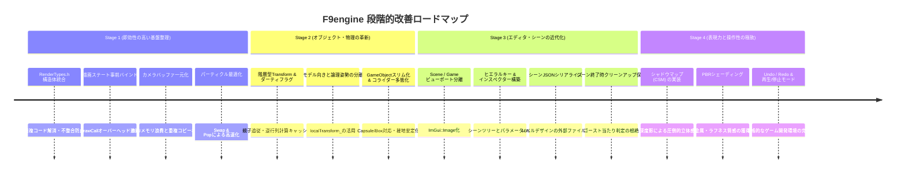

# F9engine 総合改善タスクリスト（Master Improvement Tasks）

本ドキュメントは、F9engine を商用エンジン品質へと引き上げるための**包括的改善タスクリスト**です。  
**「エディター」「レンダリング」「トランスフォーム」「オブジェクト」「シーン」「動作（パフォーマンス）」** の6大領域について、具体的な実装ステップ、対象ファイル、優先度、チェックボックスを整理しています。

---

## 全体実装ロードマップ（推奨着手順）

---

## 1. レンダリング（Rendering）改善タスク

DirectX 12の強みを活かし、CPU-GPUオーバーヘッドを極小化しつつグラフィック品質を引き上げます。

- [ ] **Task 2.1: 重複定数バッファ構造体の統合（`RenderTypes.h` の新設）**
  - **対象ファイル**: [`RenderTypes.h`](file:///c:/Users/k024g/OneDrive/デスクトップ/study/3nenn/AL/Project/project/engine/base/RenderTypes.h), [`Object3d.h`](file:///c:/Users/k024g/OneDrive/デスクトップ/study/3nenn/AL/Project/project/engine/3d/Object3d.h), [`Sprite.h`](file:///c:/Users/k024g/OneDrive/デスクトップ/study/3nenn/AL/Project/project/engine/2d/Sprite.h), [`SkyBox.h`](file:///c:/Users/k024g/OneDrive/デスクトップ/study/3nenn/AL/Project/project/engine/Tool/SkyBox.h)
  - **内容**:
    1. `TransformationMatrix`（WVP, World, WorldInverseTranspose）を一元化。
    2. `CameraForGPU`、`MaterialCB` を共通定義化。
    3. 各クラスからインナー構造体を削除し、新ヘッダーへ参照差し替え。
  - **優先度**: **最高** / **難易度**: 低

- [ ] **Task 2.2: 描画ステート事前バインド（PreDraw化）**
  - **対象ファイル**: [`Object3dCommon.h`](file:///c:/Users/k024g/OneDrive/デスクトップ/study/3nenn/AL/Project/project/engine/3d/Object3dCommon.h), [`Object3dCommon.cpp`](file:///c:/Users/k024g/OneDrive/デスクトップ/study/3nenn/AL/Project/project/engine/3d/Object3dCommon.cpp), [`Object3d.cpp`](file:///c:/Users/k024g/OneDrive/デスクトップ/study/3nenn/AL/Project/project/engine/3d/Object3d.cpp)
  - **内容**:
    1. `Object3d::Draw()` 内で毎回発行されている `SetGraphicsRootSignature`、`SetPipelineState`、`LightManager::Draw` を `Object3dCommon::PreDraw()` に引き上げ、**1フレームに1回だけセット**する。
    2. 個別の `Object3d::Draw()` は自身のWVPバッファとメッシュ描画のみにスリム化。
  - **優先度**: **最高** / **難易度**: 低

- [ ] **Task 2.3: カメラ定数バッファの一元化**
  - **対象ファイル**: [`Camera.h`](file:///c:/Users/k024g/OneDrive/デスクトップ/study/3nenn/AL/Project/project/engine/Tool/Camera.h), [`Camera.cpp`](file:///c:/Users/k024g/OneDrive/デスクトップ/study/3nenn/AL/Project/project/engine/Tool/Camera.cpp), [`Object3d.h`](file:///c:/Users/k024g/OneDrive/デスクトップ/study/3nenn/AL/Project/project/engine/3d/Object3d.h)
  - **内容**:
    1. 全 `Object3d` インスタンスが個別に保持している `cameraResource_` を廃止。
    2. `Camera` クラス自身が1つの `CameraForGPU` 定数バッファリソースを持ち、描画開始時にルートパラメータへバインド。
  - **優先度**: **最高** / **難易度**: 低

- [ ] **Task 2.4: シャドウマップ（深度影・CSM）の実装**
  - **対象ファイル**: `engine/3d/ShadowMap.h` / `.cpp`, `engine/shaders/ShadowMap.hlsl`
  - **内容**:
    1. 平行光源（太陽光）の視点からのデプスレンダーターゲット（SRVマネージャーを参考にDSVマネージャー/SRV）を作成。
    2. シャドウパスで全遮蔽オブジェクトの深度値のみを描画。
    3. メイン描画シェーダーでライト空間行列を用いて深度比較（PCFフィルタ）を行い、リアルな影を描画。
  - **優先度**: 高 / **難易度**: 高

- [ ] **Task 2.5: 動的ライトバッファへの拡張**
  - **対象ファイル**: [`LightManager.h`](file:///c:/Users/k024g/OneDrive/デスクトップ/study/3nenn/AL/Project/project/engine/Tool/LightManager.h), [`LightManager.cpp`](file:///c:/Users/k024g/OneDrive/デスクトップ/study/3nenn/AL/Project/project/engine/Tool/LightManager.cpp)
  - **内容**:
    1. 固定配列（Dir3, Point3, Spot3）を廃止し、可変長 `std::vector` で管理。
    2. 画面内に存在するライトの数をカウントバッファで渡し、シェーダー側で動的ループ処理できるようにする。
  - **優先度**: 中 / **難易度**: 中

- [ ] **Task 2.6: PBR（物理ベースレンダリング）マテリアルの導入**
  - **対象ファイル**: `engine/shaders/Object3d.PS.hlsl`, [`Model.h`](file:///c:/Users/k024g/OneDrive/デスクトップ/study/3nenn/AL/Project/project/engine/3d/Model.h)
  - **内容**:
    1. アルベド、メタリック、ラフネス、法線マップのサンプリングに対応。
    2. Cook-Torrance BRDF（GGX分布・Smith幾何減衰・Schlickフレネル）を実装。
  - **優先度**: 中 / **難易度**: 高

---

## 2. トランスフォーム（Transform）改善タスク

位置・回転・拡縮の計算基盤を強化し、親子階層・遅延評価・見た目分離を実現します。

- [ ] **Task 3.1: 階層型 `Transform` クラスの実装**
  - **対象ファイル**: [`engine/math/Transform.h`](file:///c:/Users/k024g/OneDrive/デスクトップ/study/3nenn/AL/Project/project/engine/math/Transform.h) / `Transform.cpp`
  - **内容**:
    1. `localPosition`, `localRotation` (Quaternion), `localScale` を保持。
    2. `parent_` と `children_` ポインタによる階層ツリー管理（`SetParent`, `RemoveChild`）。
    3. `GetWorldMatrix()` 呼び出し時に `localMatrix * parent->GetWorldMatrix()` を再帰合成。
  - **優先度**: 高 / **難易度**: 中

- [ ] **Task 3.2: ダーティフラグ（遅延評価）と逆行列計算キャッシュ**
  - **対象ファイル**: [`engine/math/Transform.h`](file:///c:/Users/k024g/OneDrive/デスクトップ/study/3nenn/AL/Project/project/engine/math/Transform.h), [`Object3d.cpp`](file:///c:/Users/k024g/OneDrive/デスクトップ/study/3nenn/AL/Project/project/engine/3d/Object3d.cpp)
  - **内容**:
    1. 自身または親が動いた時のみ `isDirty_ = true` に設定。
    2. `Object3d::Update()` で毎フレーム行われていた `Transpose(Inverse(worldMatrix))` を、`isDirty_` のときのみ実行するように最適化。
  - **優先度**: 高 / **難易度**: 低

- [ ] **Task 3.3: モデル向き（見た目補正）とオブジェクト論理姿勢の分離**
  - **対象ファイル**: [`Object3d.h`](file:///c:/Users/k024g/OneDrive/デスクトップ/study/3nenn/AL/Project/project/engine/3d/Object3d.h), [`Object3d.cpp`](file:///c:/Users/k024g/OneDrive/デスクトップ/study/3nenn/AL/Project/project/engine/3d/Object3d.cpp)
  - **内容**:
    1. 既存の `localTransform_` を機能させ、`worldMatrix = Multiply(modelLocalMatrix, objectWorldMatrix)` で描画行列を合成。
    2. `SetModelLocalRotate()`, `SetModelLocalTranslate()` 等のアクセサを新設し、Blenderモデルの初期向き補正やダッシュ前傾姿勢をコライダーに影響を与えずに設定可能にする。
  - **優先度**: 高 / **難易度**: 低

- [ ] **Task 3.4: クォータニオン回転（Quaternion）の全面導入**
  - **対象ファイル**: [`engine/math/Quaternion.h`](file:///c:/Users/k024g/OneDrive/デスクトップ/study/3nenn/AL/Project/project/engine/math/Quaternion.h) / `.cpp`
  - **内容**:
    1. ジンバルロックを防ぐため、トランスフォーム内部の姿勢をクォータニオンで一元保持。
    2. オイラー角（度数法）との相互変換関数、回転の滑らかな補間（`Slerp`）、指定方向を向く `LookRotation` を整備。
  - **優先度**: 中 / **難易度**: 中

---

## 3. オブジェクト（Object / Entity）改善タスク

継承ベースの神クラスを解体し、安全で保守しやすいコンポーネント指向へ段階的に移行します。

- [ ] **Task 4.1: `GameObject.h` の神クラス解消（スリム化）**
  - **対象ファイル**: [`application/Collision/GameObject.h`](file:///c:/Users/k024g/OneDrive/デスクトップ/study/3nenn/AL/Project/project/application/Collision/GameObject.h)
  - **内容**:
    1. `GroundRayPalamata` や `RayTriangleCollisionResult` などの接地用ハードコードを `GameObject` から削除。
    2. 接地判定やレイキャストを特定キャラクターのロジック、または専用の `Raycaster` クラスへ分離。
  - **優先度**: 高 / **難易度**: 低

- [ ] **Task 4.2: コライダーの多態化（Capsule / Box 対応）**
  - **対象ファイル**: [`application/Collision/Collider.h`](file:///c:/Users/k024g/OneDrive/デスクトップ/study/3nenn/AL/Project/project/application/Collision/Collider.h), [`application/Collision/Collider.cpp`](file:///c:/Users/k024g/OneDrive/デスクトップ/study/3nenn/AL/Project/project/application/Collision/Collider.cpp)
  - **内容**:
    1. `Collider` を抽象基底クラスにし、既存の球判定を `SphereCollider` に派生。
    2. `BoxCollider`（AABB/OBB: 壁・床・箱用）を新設。
    3. `CapsuleCollider`（人型用: 階段昇降・角の引っかかり防止）を新設。
  - **優先度**: 高 / **難易度**: 中

- [ ] **Task 4.3: コライダーと Transform の自動連動**
  - **対象ファイル**: [`application/Collision/Collider.h`](file:///c:/Users/k024g/OneDrive/デスクトップ/study/3nenn/AL/Project/project/application/Collision/Collider.h)
  - **内容**:
    1. コライダーが親オブジェクトの `Transform` への参照を保持。
    2. ワールド中心座標や傾きを手動同期なしで `Transform::GetWorldMatrix()` から自動算出する。
  - **優先度**: 高 / **難易度**: 低

- [ ] **Task 4.4: `Object3d` の二重Transform解消**
  - **対象ファイル**: [`application/object/player/Player.h`](file:///c:/Users/k024g/OneDrive/デスクトップ/study/3nenn/AL/Project/project/application/object/player/Player.h), [`application/object/player/Player.cpp`](file:///c:/Users/k024g/OneDrive/デスクトップ/study/3nenn/AL/Project/project/application/object/player/Player.cpp)
  - **内容**:
    1. `Player` が独自に `position_` を持ち `object_->SetTranslate()` で同期する二重管理を廃止。
    2. `object_->GetTransform()`（または自身の新Transform）に一本化。
  - **優先度**: 高 / **難易度**: 低

- [ ] **Task 4.5: プレハブ（Prefab）/ JSONシリアライズ化**
  - **対象ファイル**: `engine/Tool/PrefabManager.h` / `.cpp`
  - **内容**:
    1. オブジェクトの構成パラメータ（モデルパス、コライダーサイズ、HP、移動速度等）をJSONとしてシリアライズ・デシリアライズ可能にする。
    2. C++コードを再コンパイルせずに、JSONからオブジェクトを動的生成できるようにする。
  - **優先度**: 中 / **難易度**: 中

---

## 4. シーン（Scene）改善タスク

シーン遷移の安全性、ロード時間の短縮、レベル配置の外部データ化を推進します。

- [ ] **Task 4.1: シーン破棄時のリソースクリーンアップ保証**
  - **対象ファイル**: [`SceneManager.cpp`](file:///c:/Users/k024g/OneDrive/デスクトップ/study/3nenn/AL/Project/project/engine/scene/SceneManager.cpp), [`CollisionManager.h`](file:///c:/Users/k024g/OneDrive/デスクトップ/study/3nenn/AL/Project/project/application/Collision/CollisionManager.h), [`LightManager.h`](file:///c:/Users/k024g/OneDrive/デスクトップ/study/3nenn/AL/Project/project/engine/Tool/LightManager.h)
  - **内容**:
    1. シーン破棄時（ChangeScene）に、シングルトンマネージャに登録されたコライダー、ライト、オブジェクトのリストを確実にリセット（`Clear()`）する。
    2. 前シーンのコライダーが残留して見えない壁になるバグを根絶。
  - **優先度**: **最高** / **難易度**: 低

- [ ] **Task 4.2: シーン配置データの外部ファイル化（JSONレベルローダー）**
  - **対象ファイル**: `engine/scene/SceneLoader.h` / `.cpp`
  - **内容**:
    1. シーン上のオブジェクト配置（どのモデルをどの座標・回転・スケールで置くか）をJSONに出力・入力する。
    2. エディタ上で配置したオブジェクトをファイル保存し、ゲーム起動時に自動ロードする。
  - **優先度**: 高 / **難易度**: 中

- [ ] **Task 4.3: 非同期シーンローディング（Async Loading）**
  - **対象ファイル**: `engine/scene/AsyncSceneLoader.h` / `.cpp`
  - **内容**:
    1. `std::thread` または `std::async` を用い、バックグラウンドでテクスチャやモデルを読み込む。
    2. ロード中もメインスレッドのゲームループ（ロード画面アニメーション・プログレスバー）を止めずに描画を継続。
  - **優先度**: 中 / **難易度**: 高

- [ ] **Task 5.4: 加算ロード（Additive Scene Loading）**
  - **対象ファイル**: [`SceneManager.h`](file:///c:/Users/k024g/OneDrive/デスクトップ/study/3nenn/AL/Project/project/engine/scene/SceneManager.h), [`SceneManager.cpp`](file:///c:/Users/k024g/OneDrive/デスクトップ/study/3nenn/AL/Project/project/engine/scene/SceneManager.cpp)
  - **内容**:
    1. 常駐する「UIシーン / システムシーン」を維持したまま、背景の「ステージシーン」のみを差し替え可能にする。
  - **優先度**: 低 / **難易度**: 中

---

## 5. 動作・パフォーマンス（Performance / Runtime）改善タスク

CPU/GPUの処理落ち、メモリ断片化、スピンウェイトによる発熱を根絶します。

- [ ] **Task 6.1: パーティクルのコンテナ最適化（`std::list` ➔ `std::vector`）**
  - **対象ファイル**: [`ParticleManager.h`](file:///c:/Users/k024g/OneDrive/デスクトップ/study/3nenn/AL/Project/project/engine/Tool/ParticleManager.h), [`ParticleManager.cpp`](file:///c:/Users/k024g/OneDrive/デスクトップ/study/3nenn/AL/Project/project/engine/Tool/ParticleManager.cpp)
  - **内容**:
    1. `std::list<Particle>` を連続メモリの `std::vector<Particle>` に置き換え。
    2. 寿命切れ要素の削除を `erase()` から「末尾要素と交換して `pop_back()`（Swap & Pop）」に変更。
    3. 毎フレームのヒープ `delete` とCPUキャッシュミスを解消し、数千個のパーティクルを高速処理。
  - **優先度**: 高 / **難易度**: 低

- [ ] **Task 6.2: FPS固定スピンウェイト（ビジーループ）の解消**
  - **対象ファイル**: [`DXCommon.cpp`](file:///c:/Users/k024g/OneDrive/デスクトップ/study/3nenn/AL/Project/project/engine/base/DXCommon.cpp)
  - **内容**:
    1. `sleep_for(1us)` による高負荷スピンウェイトを改修。
    2. `SwapChain->Present(1, 0)` のハードウェア垂直同期（VSync）を主軸にし、不要なCPU 1コア100%消費とファンの騒音を低減。
  - **優先度**: 高 / **難易度**: 低

- [ ] **Task 6.3: 可変デルタタイム（DeltaTime）の導入**
  - **対象ファイル**: [`Framework.cpp`](file:///c:/Users/k024g/OneDrive/デスクトップ/study/3nenn/AL/Project/project/engine/GAME/Framework.cpp), [`SceneManager.cpp`](file:///c:/Users/k024g/OneDrive/デスクトップ/study/3nenn/AL/Project/project/engine/scene/SceneManager.cpp)
  - **内容**:
    1. フレーム間の実経過時間を計測し、`Update(float deltaTime)` を各オブジェクトへ伝播。
    2. 処理落ち発生時のスローモーション化や、144Hzディスプレイでの倍速動作を防止。
  - **優先度**: 高 / **難易度**: 低

- [ ] **Task 6.4: コリジョン判定の空間枝刈り（ブロードフェーズ）**
  - **対象ファイル**: [`CollisionManager.cpp`](file:///c:/Users/k024g/OneDrive/デスクトップ/study/3nenn/AL/Project/project/application/Collision/CollisionManager.cpp)
  - **内容**:
    1. 静的オブジェクト同士（壁 vs 床など）を最初から判定リストに入れない。
    2. 各コライダーにバウンディング球（中心座標・半径）をキャッシュし、純粋なfloat演算で高速に遠方ペアを除外。
  - **優先度**: 中 / **難易度**: 低

---
## 6. エディター（Editor）改善タスク

ゲーム内ImGui直接描画から、UnityやUnreal Engineのような「独立したエディタ環境」を構築します。

- [ ] **Task 6.1: SceneビューとGameビューの完全分離**
  - **対象ファイル**: [`OffScreen.h`](file:///c:/Users/k024g/OneDrive/デスクトップ/study/3nenn/AL/Project/project/engine/base/OffScreen.h), [`OffScreen.cpp`](file:///c:/Users/k024g/OneDrive/デスクトップ/study/3nenn/AL/Project/project/engine/base/OffScreen.cpp), [`Framework.cpp`](file:///c:/Users/k024g/OneDrive/デスクトップ/study/3nenn/AL/Project/project/engine/GAME/Framework.cpp)
  - **内容**:
    1. オフスクリーンレンダーターゲットのSRV記述子を `ImGui::Image` に渡し、ImGuiウィンドウ内にゲーム画面を描画。
    2. エディタ専用の自由移動カメラ（SceneCamera）を用意し、「編集用Sceneビュー」と「本番Gameビュー」の2画面タブを分離。
  - **優先度**: 高 / **難易度**: 中

- [ ] **Task 6.2: ヒエラルキー（Hierarchy）ウィンドウの実装**
  - **対象ファイル**: `engine/Tool/Editor/HierarchyWindow.h` / `.cpp`
  - **内容**:
    1. シーン内に存在する全オブジェクトを `ImGui::TreeNode` でツリー構造表示。
    2. オブジェクトをクリックで選択状態（SelectedObject）にする。
    3. ドラッグ＆ドロップでオブジェクト間の親子関係（Parent-Child）を付け替え可能にする。
  - **優先度**: 中 / **難易度**: 中

- [ ] **Task 6.3: インスペクター（Inspector）ウィンドウの実装**
  - **対象ファイル**: `engine/Tool/Editor/InspectorWindow.h` / `.cpp`
  - **内容**:
    1. 選択中オブジェクトの Transform（Position, Rotation, Scale）を `ImGui::DragFloat3` で数値編集可能にする。
    2. マテリアル色、コライダー半径/サイズ、モデルパスなどを動的に編集・確認可能にする。
    3. [`ImGuizmo.cpp`](file:///c:/Users/k024g/OneDrive/デスクトップ/study/3nenn/AL/Project/project/externals/imgui/ImGuizmo.cpp) と連動し、Sceneビュー上で選択オブジェクトに移動・回転ギズモを表示。
  - **優先度**: 高 / **難易度**: 中

- [ ] **Task 1.4: プレイ／ポーズ／コマ送り（Play/Pause/Step）モードの分離**
  - **対象ファイル**: [`Framework.cpp`](file:///c:/Users/k024g/OneDrive/デスクトップ/study/3nenn/AL/Project/project/engine/GAME/Framework.cpp), [`SceneManager.cpp`](file:///c:/Users/k024g/OneDrive/デスクトップ/study/3nenn/AL/Project/project/engine/scene/SceneManager.cpp)
  - **内容**:
    1. エンジン状態として `EditMode`, `PlayMode`, `PauseMode` を導入。
    2. EditMode中はエディタカメラの移動とギズモ操作のみ行い、オブジェクトの更新（AI, 物理, 入力）を停止。
    3. Playボタン押下時にシミュレーション開始。Stopボタンで再生開始前の配置状態に自動復元（Restore）。
  - **優先度**: 中 / **難易度**: 高

- [ ] **Task 1.5: 操作の取り消し・やり直し（Undo / Redo）**
  - **対象ファイル**: `engine/Tool/Editor/CommandManager.h` / `.cpp`
  - **内容**:
    1. コマンドパターンを導入（`ICommand::Execute()`, `Undo()`）。
    2. オブジェクトの移動、回転、配置、削除の操作履歴をスタックに保存し、`Ctrl+Z` / `Ctrl+Y` で取り消し・やり直しを可能にする。
  - **優先度**: 低 / **難易度**: 中

- [ ] **Task 1.6: シェーダーホットリロードの実装**
  - **対象ファイル**: [`PSOManager.cpp`](file:///c:/Users/k024g/OneDrive/デスクトップ/study/3nenn/AL/Project/project/engine/base/PSOManager.cpp)
  - **内容**:
    1. HLSLファイルの更新日時（タイムスタンプ）を監視。
    2. ファイル保存を検知したら、ゲームを停止させずにバックグラウンドで `D3DCompile` を再実行し、PSOを動的再生成して即座に画面に反映。
  - **優先度**: 中 / **難易度**: 低

---

## 総合タスク管理チェックリスト（クイックリファレンス）

| 領域 | タスク名 | 難易度 | 優先度 | 状態 |
| :---: | :--- | :---: | :---: | :---: |
| **レンダリング** | Task 2.1: 重複定数バッファ統合（`RenderTypes.h`） | 低 | **最高** | [ ] 未着手 |
| **レンダリング** | Task 2.2: 描画ステート事前バインド（PreDraw化） | 低 | **最高** | [ ] 未着手 |
| **レンダリング** | Task 2.3: カメラ定数バッファの一元化 | 低 | **最高** | [ ] 未着手 |
| **シーン** | Task 5.1: シーン破棄時クリーンアップ保証 | 低 | **最高** | [ ] 未着手 |
| **トランスフォーム** | Task 3.1: 階層型Transform（親子関係） | 中 | **高** | [ ] 未着手 |
| **トランスフォーム** | Task 3.2: ダーティフラグと逆行列計算キャッシュ | 低 | **高** | [ ] 未着手 |
| **トランスフォーム** | Task 3.3: モデル向きとオブジェクト論理姿勢の分離 | 低 | **高** | [ ] 未着手 |
| **オブジェクト** | Task 4.1: GameObjectスリム化（特定コード剥離） | 低 | **高** | [ ] 未着手 |
| **オブジェクト** | Task 4.2: コライダー多態化（Capsule / Box対応） | 中 | **高** | [ ] 未着手 |
| **オブジェクト** | Task 4.3: コライダーとTransformの自動連動 | 低 | **高** | [ ] 未着手 |
| **オブジェクト** | Task 4.4: Object3d二重Transform解消 | 低 | **高** | [ ] 未着手 |
| **動作** | Task 6.1: パーティクルのvector化 (Swap & Pop) | 低 | **高** | [ ] 未着手 |
| **動作** | Task 6.2: FPS固定ビジーループの解消 (VSync) | 低 | **高** | [ ] 未着手 |
| **動作** | Task 6.3: 可変デルタタイム導入 | 低 | **高** | [ ] 未着手 |
| **エディター** | Task 1.1: Scene / Game ビューポート分離 | 中 | **高** | [ ] 未着手 |
| **エディター** | Task 1.3: インスペクターウィンドウの実装 | 中 | **高** | [ ] 未着手 |
| **レンダリング** | Task 2.4: シャドウマップ（深度影・CSM） | 高 | **高** | [ ] 未着手 |
| **シーン** | Task 5.2: シーン配置JSON外部ファイル化 | 中 | **高** | [ ] 未着手 |
| **エディター** | Task 1.2: ヒエラルキーウィンドウの実装 | 中 | **中** | [ ] 未着手 |
| **エディター** | Task 1.4: プレイ/ポーズ/コマ送りモード分離 | 高 | **中** | [ ] 未着手 |
| **エディター** | Task 1.6: シェーダーホットリロード | 低 | **中** | [ ] 未着手 |
| **レンダリング** | Task 2.5: 動的ライトバッファ拡張 | 中 | **中** | [ ] 未着手 |
| **レンダリング** | Task 2.6: PBR（物理ベースレンダリング） | 高 | **中** | [ ] 未着手 |
| **トランスフォーム** | Task 3.4: クォータニオン回転の全面導入 | 中 | **中** | [ ] 未着手 |
| **オブジェクト** | Task 4.5: プレハブ / JSONシリアライズ化 | 中 | **中** | [ ] 未着手 |
| **シーン** | Task 5.3: 非同期シーンローディング | 高 | **中** | [ ] 未着手 |
| **動作** | Task 6.4: コリジョン判定の空間枝刈り | 低 | **中** | [ ] 未着手 |
| **エディター** | Task 1.5: 操作のUndo / Redo | 中 | **低** | [ ] 未着手 |
| **シーン** | Task 5.4: 加算ロード（Additive Loading） | 中 | **低** | [ ] 未着手 |
